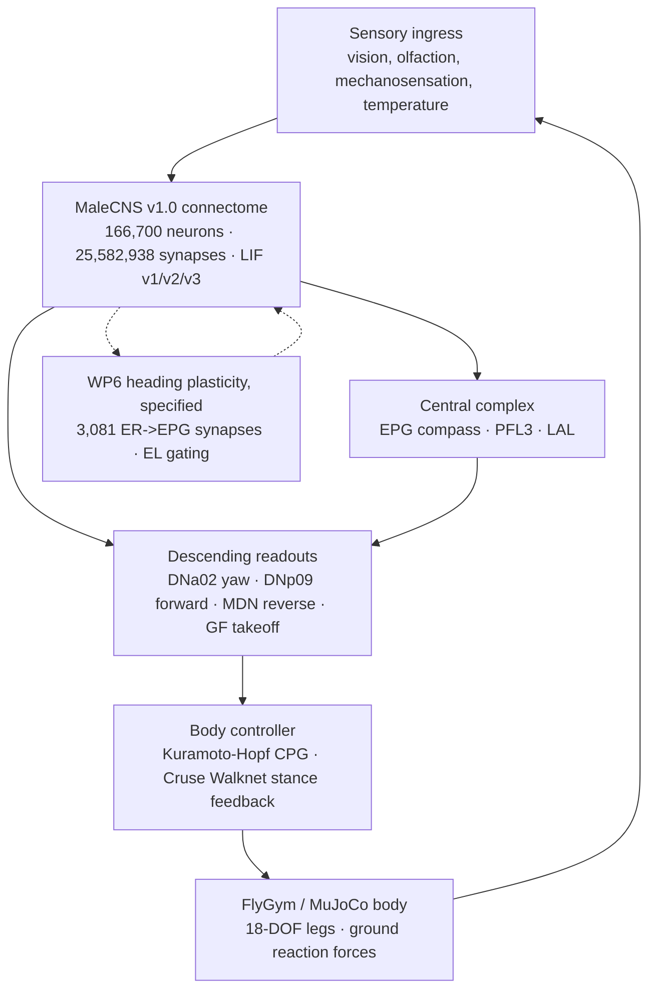

# Project NeuroFly

[](https://github.com/average-user-887/flybrain/actions/workflows/ci.yml)
[](https://opensource.org/licenses/MIT)
[](https://www.python.org/downloads/)
[](https://github.com/NeLy-EPFL/flygym)
[](https://mujoco.org)

Project NeuroFly couples the MaleCNS v1.0 *Drosophila* connectome (166,700 neurons, 25,582,938 synapses) to an articulated 18-DOF FlyGym/MuJoCo body, with a browser dashboard and headless experiment runners.

## Current status (checked against receipts, 2026-09-24)

This is research software at the ground-truth stage (ROADMAP Phase 0). What the receipts in [`docs/receipts/`](docs/receipts/README.md) support today:

- **The connectome has not passed a behavioural test on the current engine.** Every paradigm is *Mapped, untested on v3* in the [capability matrix](docs/CAPABILITY_MATRIX.md).
- **The only positive optomotor result came from the v1 engine**, which runs away at about 10⁶ spikes/s. It was withdrawn on 2026-09-20. The v2 re-run was NULL. The v3 preregistered confirmatory run has not been done yet.
- **The connectome closed-loop receipts are 1 s smoke tests on v1.** They show that the loop runs, not that the fly behaves.
- **The modular controller runs all 14 assays in the live dashboard** (automated Firefox sign-off). Its behaviour has not been compared with published fly data.
- **Receipts that need re-running** are listed in the [re-run queue](docs/receipts/README.md#re-run-queue). They include anything the daemon labelled "v3" before PR #4, because until then it ran v3 equations on v1 weights.

## Architecture



1. **Connectome graph and LIF engine** (`brainlab/`):
   - MaleCNS v1.0, pinned by SHA-256 (`4b2f87cc...`) and verified at load (`docs/receipts/graph_identity.json`).
   - Three declared dynamics versions. **v3** (conductance LIF, per-sign PSP calibration, aminergic neurons modulatory-only) is the default for the daemon. Its calibration probes pass (`docs/receipts/lif_dynamics_v3.json`), but it has no behavioural result yet. See [`docs/LIF_DYNAMICS_SPEC.md`](docs/LIF_DYNAMICS_SPEC.md).
   - Only the optomotor IO map and the WP6 visual-heading IO map are resolved from annotations and pinned. The other sensory channels and DN roles are declared but not verified.
2. **Embodied body** (`neurofly_body/`): FlyGym 2.1.0 on MuJoCo 3.9.0, stepped in lockstep with the v3 connectome through `brainlab.cosim_server`. No embodied run has a committed receipt yet.
3. **14 paradigms**: all 14 assays exist and run with the modular controller. On the connectome they are *Mapped, untested on v3*. See [`docs/CAPABILITY_MATRIX.md`](docs/CAPABILITY_MATRIX.md).
4. **WP6 visual-heading plasticity**: a depression-only rule on 3,081 `ER4d`/`ER2` → `EPG` synapses, gated by the octopaminergic `EL` cluster, with no sign flips. It is specified and implemented, and has had a single 1 s smoke run on v1. See [`docs/WP6_PLASTICITY_SPEC.md`](docs/WP6_PLASTICITY_SPEC.md).
5. **Dashboard** (`web/`): Three.js viewport, premotor HUD (`DNa02 L/R`, `DNp09`, `MDN`, `GF`), and assay switching that keeps checkpointed brains. It is verified in real Firefox against the modular backend (`docs/receipts/live-signoff/`).

## Performance

Simulated seconds per wall-clock second (1.0 = real time). The CPU kernel is the reference; the GPU runs the same float64 maths.

| Workload | Laptop i5-1334U | Ryzen 5600X CPU | Ryzen GTX 1660 Ti | Source |
|---|---|---|---|---|
| Brain, MaleCNS, v3 | 0.0085 | 0.041 | 0.40 | PR #2 (`scripts/benchmark.py`) |
| Full daemon, connectome, open-arena | 0.017 | 0.0405 | 0.398 | PR #2; measured on v1 weights (see note) |
| Body alone (FlyGym, fast controller loop, bit-identical physics) | | | | 0.55 on a 4-vCPU cloud Xeon (0.107 before); `docs/receipts/body_speedup/` |
| Modular daemon, wind tunnel, 100x requested | | about 30 | | `docs/receipts/wp1_wp2/stress_100x_current.json` |

- **The GPU is the default** for v3 brains whenever CuPy or numba.cuda can see a CUDA device. `NEUROFLY_BRAIN_BACKEND=cpu|cuda|auto` overrides it. v1 and v2 always run on the CPU.
- **GPU vs CPU accuracy** (MaleCNS, 2 s, `scripts/gpu_parity.py`): per-neuron rate correlation 0.9986 and 0.47 % spike difference. A 1e-5 mV nudge makes the CPU diverge from itself by a similar amount (r 0.9993) at the same moment (34 ms). Two GPU runs are identical, and on small graphs the GPU matches the CPU spike for spike.
- **Note:** the full-daemon row was measured before PR #4, so the daemon ran v3 equations on v1 weights. The brain rows used the real v3 policy. The GPU JSON receipts are not committed yet; both are in the [re-run queue](docs/receipts/README.md#re-run-queue).
- The connectome does not run in real time on any measured host. Full accuracy takes priority over speed, and runs are meant to be queued and replayed.

---

## Installation

### Prerequisites
- Python 3.12 (recommended, supports FlyGym 2.1.0 and MuJoCo 3.9.0) or Python 3.11 (core graph only).
- Linux / macOS (Windows supported via WSL2).

### Editable Install
```bash
git clone git@github.com:average-user-887/flybrain.git
cd flybrain
python3 -m venv .venv
source .venv/bin/activate
pip install -e ".[body,test]"
```

### Docker
```bash
docker build -t neurofly:latest .
docker run -p 8769:8769 neurofly:latest
```

---

## Canonical CLI Commands

NeuroFly provides a single unified CLI entry point `neurofly`:

```bash
# Check dependencies, graph identity and plasticity circuit wiring
neurofly status

# Print the 14-paradigm capability matrix
neurofly capability

# Download and verify MaleCNS v1.0 source tables (1.1 GB)
neurofly download-data

# Launch the continuous simulation daemon with 3D web dashboard
neurofly run --port 8769 --paradigm multisensory-sandbox
```

The daemon runs the connectome backends with **v3 dynamics** (conductance LIF plus the v3
transmitter policy) by default. `--dynamics v1` (or `NEUROFLY_LIF_DYNAMICS=v1`) selects the
original current-based model. Saved brains never cross versions: v1 brains stay in
`outputs/registry/`, v3 brains live in `outputs/registry-v3/`. v3 brains run on an NVIDIA GPU
automatically when CuPy or numba.cuda can see one (`NEUROFLY_BRAIN_BACKEND=cpu` forces the CPU
reference kernel).

`neurofly full-sim` does not apply the v3 transmitter policy yet, so it runs v3 equations on
v1 weights. Do not use its output as a v3 result.

Once it is running, open `http://localhost:8769` to see the fly, watch premotor firing rates, and trigger stimuli.

---

## Verification & Testing

Tests cover the unit, integration and physics co-simulation layers. They show that code paths run and are deterministic. They are not behavioural evidence; that comes from receipts.

```bash
# Run embodied physics verification tests (MuJoCo/FlyGym)
NEUROFLY_RUN_PHYSICS=1 pytest -v tests/test_embodied_*.py

# Run WP6 visual-heading plasticity tests
pytest -v tests/test_wp6_plasticity.py

# Run private infrastructure leak audit
./scripts/check_private_infra.sh

# Run the entire test suite (>520 tests)
pytest tests/
```

---

## Documentation Index

- [`docs/CAPABILITY_MATRIX.md`](docs/CAPABILITY_MATRIX.md): what each of the 14 paradigms can do today, with receipts.
- [`docs/receipts/README.md`](docs/receipts/README.md): every receipt, which engine produced it, and the re-run queue.
- [`docs/ROADMAP.md`](docs/ROADMAP.md): the phased roadmap (P0 to P7), with an owner sign-off at each gate.
- [`docs/WP5_OPTOMOTOR.md`](docs/WP5_OPTOMOTOR.md): the optomotor experiment, with its v1 and v2 results.
- [`docs/WP6_PLASTICITY_SPEC.md`](docs/WP6_PLASTICITY_SPEC.md): Mathematical specification of the ER $\to$ EPG visual heading plasticity protocol.
- [`docs/LIF_DYNAMICS_SPEC.md`](docs/LIF_DYNAMICS_SPEC.md): Specification of the conductance-based `v3` LIF spiking kernel.
- [`docs/EMBODIED_MVP.md`](docs/EMBODIED_MVP.md): Setup and usage guide for FlyGym embodied co-simulation.
- [`docs/DATA_SCHEMA.md`](docs/DATA_SCHEMA.md): Telemetry, event logging, and checkpoint format schemas.

---

## Scientific Honesty & Ground Truth Policy

1. **No Faked Pathways**: Connectome channels are resolved strictly by stable body ID, cell type, and somatic lateralization from released Janelia MaleCNS v1.0 metadata. Unmapped channels are explicitly labelled `graph-unmapped-io` and halt motor output rather than inventing commands.
2. **Receipts, not assertions**: every capability claim in this README and the capability matrix points to a file in `docs/receipts/`. A claim with no receipt, or with a receipt from a superseded engine, is labelled as such.
3. **Open Access Data**: MaleCNS v1.0 connectome data is CC BY 4.0; FlyGym and MuJoCo are Apache-2.0; Project NeuroFly code is MIT. See [NOTICE](NOTICE) for citations.
