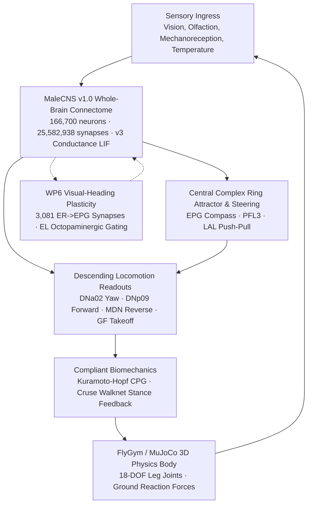

# Project NeuroFly

[](https://github.com/average-user-887/flybrain/actions/workflows/ci.yml)
[](https://opensource.org/licenses/MIT)
[](https://www.python.org/downloads/)
[](https://github.com/NeLy-EPFL/flygym)
[](https://mujoco.org)

Project NeuroFly couples the complete, verified 166.7K-neuron MaleCNS v1.0 *Drosophila* connectome to an articulated 18-DOF biomechanical body simulated in MuJoCo via FlyGym.

The simulation runs closed-loop in real-time or accelerated time, supporting both an in-browser 3D dashboard and automated headless scientific experiments.

---

## Architectural Highlights



1. **Whole-Brain MaleCNS v1.0 Spiking Graph**:
   - 166,700 annotated neurons, 25,582,938 directed synaptic connections.
   - Conductance-based `v3` LIF dynamics with physiological reversal potentials and quiet inter-stimulus baselines.
   - Pinned graph SHA-256 verification (`4b2f87cc...`) ensuring exact reproducibility.
2. **Embodied Biomechanics (MuJoCo & FlyGym)**:
   - 18-DOF anatomical articulated body with Coxa, Femur, and Tibia joints across all 6 legs.
   - Cruse Walknet stance maintenance under cuticular load (campaniform sensilla feedback).
   - Coupled Kuramoto-Hopf oscillators producing physiological alternating tripod gait.
3. **14-Paradigm Capability Matrix**:
   - Full coverage across 14 classical *Drosophila* neuroethology paradigms documented in [`docs/CAPABILITY_MATRIX.md`](docs/CAPABILITY_MATRIX.md).
   - Batched sensory ingress: visual optic flow & looming (LC4/LPLC2 $\to$ DNp01), olfaction (ORNs $\to$ AL $\to$ MB), wind mechanoreception (JON-C/E $\to$ Wedge), and antennal thermoreception (TRN $\to$ SEZ).
4. **WP6 Visual-Heading Plasticity**:
   - Biologically grounded plasticity on 3,081 visually driven ring-neuron to compass-neuron synapses (`ER4d` + `ER2` $\to$ `EPG`).
   - Two-factor depression gated by the octopaminergic `EL` cluster; sign flips strictly forbidden ($w \le 0$ always).
5. **Interactive 3D Dashboard**:
   - Zero-dependency Three.js 3D articulated viewport with tarsal ground contact indicators.
   - Premotor HUD streaming real-time firing rates for `DNa02 L/R`, `DNp09`, `MDN`, and `GF` (DNp01).
   - Seamless multi-assay switching preserving checkpointed brain states and learned synaptic weights.

---

## Installation

### Prerequisites
- Python 3.12 (recommended, supports FlyGym 2.1.0 and MuJoCo 3.9.0) or Python 3.11 (core graph only).
- Linux / macOS (Windows supported via WSL2).

### Editable Install
```bash
git clone git@github.com:average-user-887/flybrain.git
cd flybrain
python3 -m venv .venv
source .venv/bin/activate
pip install -e ".[body,test]"
```

### Docker
```bash
docker build -t neurofly:latest .
docker run -p 8769:8769 neurofly:latest
```

---

## Canonical CLI Commands

NeuroFly provides a single unified CLI entry point `neurofly`:

```bash
# Check environment dependencies, graph verification, and plasticity circuits
neurofly status

# Inspect the authoritative 14-paradigm capability matrix
neurofly capability

# Download and verify MaleCNS v1.0 source tables (1.1 GB)
neurofly download-data

# Launch the continuous simulation daemon with 3D web dashboard
neurofly run --port 8769 --paradigm multisensory-sandbox
```

The daemon runs the connectome backends with **v3 dynamics** (conductance LIF plus the v3
transmitter policy) by default. `--dynamics v1` (or `NEUROFLY_LIF_DYNAMICS=v1`) selects the
original current-based model. Saved brains never cross versions: v1 brains stay in
`outputs/registry/`, v3 brains live in `outputs/registry-v3/`. v3 brains run on an NVIDIA GPU
automatically when CuPy or numba.cuda can see one (`NEUROFLY_BRAIN_BACKEND=cpu` forces the CPU
reference kernel).

Once running, navigate to `http://localhost:8769` in your browser to inspect the 3D articulated fly, observe premotor firing rates, and trigger sensory stimuli.

---

## Verification & Testing

NeuroFly enforces strict regression testing across unit, integration, and physics co-simulation layers:

```bash
# Run embodied physics verification tests (MuJoCo/FlyGym)
NEUROFLY_RUN_PHYSICS=1 pytest -v tests/test_embodied_*.py

# Run WP6 visual-heading plasticity tests
pytest -v tests/test_wp6_plasticity.py

# Run private infrastructure leak audit
./scripts/check_private_infra.sh

# Run the entire test suite (>520 tests)
pytest tests/
```

---

## Documentation Index

- [`docs/CAPABILITY_MATRIX.md`](docs/CAPABILITY_MATRIX.md): Detailed 14-paradigm sensory ingress and motor readout specification.
- [`docs/ROADMAP.md`](docs/ROADMAP.md): 5-phase engineering roadmap and validation milestones.
- [`docs/WP6_PLASTICITY_SPEC.md`](docs/WP6_PLASTICITY_SPEC.md): Mathematical specification of the ER $\to$ EPG visual heading plasticity protocol.
- [`docs/LIF_DYNAMICS_SPEC.md`](docs/LIF_DYNAMICS_SPEC.md): Specification of the conductance-based `v3` LIF spiking kernel.
- [`docs/EMBODIED_MVP.md`](docs/EMBODIED_MVP.md): Setup and usage guide for FlyGym embodied co-simulation.
- [`docs/DATA_SCHEMA.md`](docs/DATA_SCHEMA.md): Telemetry, event logging, and checkpoint format schemas.

---

## Scientific Honesty & Ground Truth Policy

1. **No Faked Pathways**: Connectome channels are resolved strictly by stable body ID, cell type, and somatic lateralization from released Janelia MaleCNS v1.0 metadata. Unmapped channels are explicitly labelled `graph-unmapped-io` and halt motor output rather than inventing commands.
2. **Empirical Verification**: Every capability claim in the capability matrix is backed by reproducible automated unit tests or recorded telemetry receipts.
3. **Open Access Data**: MaleCNS v1.0 connectome data is CC BY 4.0; FlyGym and MuJoCo are Apache-2.0; Project NeuroFly code is MIT. See [NOTICE](NOTICE) for citations.
