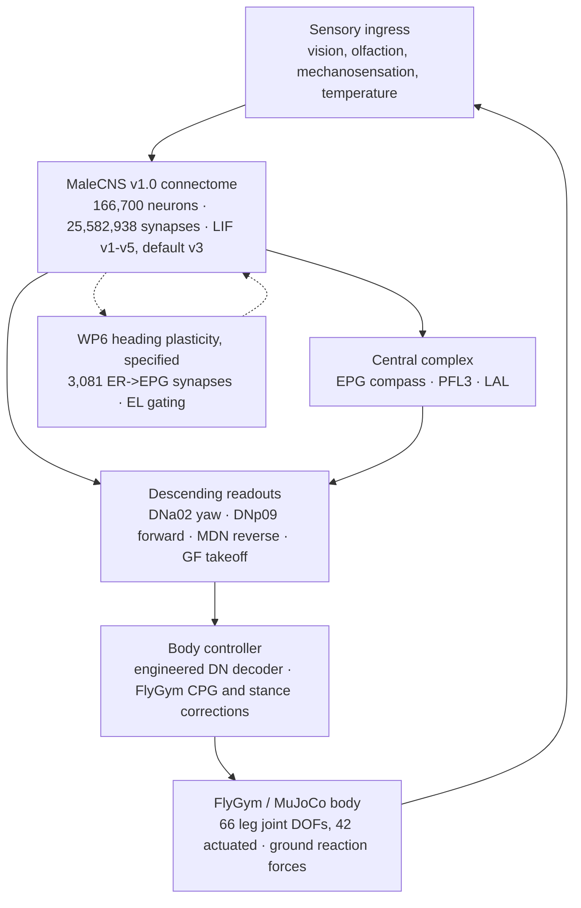

# Project NeuroFly

[](https://github.com/average-user-887/flybrain/actions/workflows/ci.yml)
[](https://opensource.org/licenses/MIT)
[](https://www.python.org/downloads/)
[](https://github.com/NeLy-EPFL/flygym)
[](https://mujoco.org)

Project NeuroFly runs a spiking model of the whole MaleCNS v1.0 *Drosophila* connectome (166,700 neurons, 25,582,938 synapses) and couples it to an articulated FlyGym/MuJoCo fly body (66 leg joint degrees of freedom, 42 of them actuated; [receipt](docs/receipts/flygym_body_dofs.md)). It has a browser dashboard and headless experiment runners.

It is research software. **The simulated fly does not yet behave because of its connectome**: read the status section below before drawing any conclusion from what you see on screen.

The connectome data are not ours. They come from the MaleCNS project (FlyEM at HHMI Janelia, University of Cambridge, MRC LMB and Google Research) under CC BY 4.0. See [Data and attribution](#data-and-attribution).

## Current status (checked against receipts, 5 October 2026)

Short version: the connectome model runs, and a signal can be routed through it to a turning command, but only when the experimenter supplies the motion detection that the fly's own visual system would compute. When the model has to compute that itself from photoreceptor input, it does not. Every point below links to the file that supports it.

**The brain scan is used as published, and where it is incomplete we say so rather than fill it in.** This is an owner ruling ([`docs/OWNER_DECISIONS.md`](docs/OWNER_DECISIONS.md), 5 October 2026).

- **NeuroFly adds no connections.** Checked on 5 October 2026: the engine graph has exactly the source's 25,582,938 connections, with the identical set of (presynaptic, postsynaptic) pairs. Every weight is the scan's synapse count × 0.275, with its sign taken from the scan's predicted transmitter ([`OWNER_DECISIONS.md`](docs/OWNER_DECISIONS.md), "Evidence the scan is currently uncontaminated"). The dynamics versions apply declared *interpretations of how transmission works* at run time; for example, v3's transmitter policy gives aminergic neurons no fast synaptic effect. These change how signals pass, not what is wired to what, and the stored graph is never altered.
- **The scan is incomplete exactly where vision starts.** About 55% of the lamina cells that should receive photoreceptor input receive none in MaleCNS (L1 54.4%, L2 54.2%, L3 55.9%). Nern *et al.* 2025 note that the lamina is the one optic-lobe neuropil the dataset does not cover completely ([`LITERATURE_SCAN_2026-10-05.md`](docs/LITERATURE_SCAN_2026-10-05.md) §A1, verified on the engine graph).
- **On the real scan, the simulated visual system does not compute the direction of motion** (details below). That is the result. We report it as it stands; we will not "fix" it by inventing the missing wiring.

- **The dashboard fly may be the hand-built controller, not the connectome; which one depends on how you start it** (see [Running the dashboard](#running-the-dashboard)). `./start_daemon.sh` starts the hand-built *modular* controller by default ([`start_daemon.sh`](start_daemon.sh), `BACKEND="${NEUROFLY_BACKEND:-modular}"`). `neurofly run` defaults to the `connectome-fixed` backend and needs the prepared MaleCNS graph ([`neurofly_daemon.py`](neurofly_daemon.py), `--backend`). The connectome backends exist and run. None has passed a behavioural validation, and every paradigm except optomotor is *Mapped, untested on v3* in the [capability matrix](docs/CAPABILITY_MATRIX.md). The modular controller's behaviour has never been compared with published fly data.
- **Optomotor turning, with motion detection supplied by us: provisional pass.** If the input encoder *imposes* direction selectivity on the T4/T5 motion-detector cells, the v3 model routes that signal through the graph to a turn that depends on the DNa02 descending neurons (silencing DNa02 gives exactly zero yaw). The preregistered run `optomotor-yaw-v3-2` passed 7/7 behaviour gates and 5/5 physiology checks, so its verdict is **PASS_PROVISIONAL** ([receipt](docs/receipts/validation/optomotor-yaw-v3-2.md)). Because the encoder does the motion detection that the circuit should do, this is not evidence that the connectome computes the optomotor response ([`OWNER_DECISIONS.md`](docs/OWNER_DECISIONS.md), 27 September 2026). Four further reasons it is not more than provisional:
  - all five gating firing-rate bounds were unverified when it ran;
  - the HS-cell checks were made report-only *after* the earlier run [v3-1](docs/receipts/validation/optomotor-yaw-v3-1.md) failed on them, so this pass is not blind on HS;
  - the driven DNa02 rates (4.4 and 1.8 Hz) are roughly 20x below the 93-128 spikes/s reported for real DNa02 during steering (a literature lead, not yet verified; [`LITERATURE_BENCHMARKS.md`](docs/LITERATURE_BENCHMARKS.md) §8);
  - the raw `receipt.json` lives on the run host and is not in this repository; the numbers in the record were relayed from it.
- **The size of that turn depends on an assumed constant.** The chloride reversal potential `E_inh` is not well measured in adult flies. In a preregistered sweep, the verdict stayed positive at −70 mV and −60 mV, but the effect shrank by about a third at −60 mV (turning index +0.0671 → +0.0452, effect size dz 3.18 → 1.47). At −56 mV, the one value a *Drosophila* measurement supplies, the run was stopped at the declared gate, so its verdict is unknown ([`EINH_SENSITIVITY.md`](docs/EINH_SENSITIVITY.md) §5-§6).
- **The connectome does not compute direction selectivity from photoreceptor input.** Driving only the photoreceptors (R1-R6) and leaving every later stage to the graph gives no direction-selective T4/T5 cells under v3, v4 (graded transmission) or v5 (receptor-class synaptic kinetics), and DNa02 does not steer ([`WP5_OPTOMOTOR.md`](docs/WP5_OPTOMOTOR.md) §13-§14; [`lif_dynamics_v4.json`](docs/receipts/lif_dynamics_v4.json), [`lif_dynamics_v5.json`](docs/receipts/lif_dynamics_v5.json)). Two diagnosed causes:
  - **The signal fades on the way.** In the full-field flicker condition, the modulation at the right-eye photoreceptors is about 9.5 mV and at T4/T5 about 0.02-0.05 mV, a loss of roughly 200-500x (`D4` amplitudes in [`docs/receipts/v5_raw/`](docs/receipts/v5_raw/)). Part of this is a data gap: about 55% of lamina L1-L3 cells in MaleCNS receive no photoreceptor synapse at all ([`LITERATURE_SCAN_2026-10-05.md`](docs/LITERATURE_SCAN_2026-10-05.md) §A1).
  - **The inputs that should differ in timing arrive in the wrong order.** In the animal Mi1 responds 18 ms after Tm3; the model gets that order backwards in every run, and puts Tm1 and Tm2 within 1 ms of each other ([`WP5_OPTOMOTOR.md`](docs/WP5_OPTOMOTOR.md) §14.4).
- **The embodied loop turns the right way, through one pair of neurons.** With the v3 graph driving the FlyGym body through a single DNa02 pair, reversing the visual stimulus reversed the turn on 2 of 2 seeds, a zero stimulus gave no net turn, and cutting the output path stopped locomotion ([`embodied_mvp_verification.md`](docs/receipts/embodied_mvp_verification.md)). This is not a walking fly: it covers about 1 mm/s against 10-20 mm/s for a real fly. The link from DNa02 to the walking pattern generator is an engineered decoder, not a model of the fly's ventral nerve cord, and the whole motor command comes from 1-30 spikes in two neurons.
- **Reproducibility depends on the engine.** v3 on the GPU gave identical spike trains in two repeat runs ([`gpu-parity-malecns-1f4a58a.json`](docs/receipts/ryzen/gpu-parity-malecns-1f4a58a.json), `gpu_repeat_identical`). **v4 is not bit-reproducible run to run on the GPU on the real graph**: two identical v4 runs differed by up to 1.1×10⁻⁵ mV in membrane potential with the same spike count (41,004). The v5 engine, run with v4's time constants, differed from v4 by the same amount, which the receipt attributes to the same GPU rounding; a repeat of v5 against itself was not run, so treat v5 GPU runs as not bit-reproducible too ([`lif_dynamics_v5.json`](docs/receipts/lif_dynamics_v5.json), falsifier `F1`; these runs were on a Quadro P620). On small synthetic graphs v4 and v5 are bit-identical on CPU and GPU. Across machines, the CPU backend gave bit-identical runs on two different AMD CPUs with the same library versions; other CPUs, library versions and the GPU backend are untested (see [Performance](#performance)).

Older results that are still on record: the only strongly positive optomotor result came from the v1 engine, which runs away at about 10⁶ spikes/s, and was withdrawn on 2026-09-20; the v2 re-run was NULL ([`WP5_OPTOMOTOR.md`](docs/WP5_OPTOMOTOR.md) §1-§11). The closed-loop connectome receipts in [`docs/receipts/`](docs/receipts/README.md) are 1 s v1 smoke tests: they show the loop runs, not that the fly behaves.

## Architecture


```mermaid
graph TD
    A[Sensory ingress<br/>vision, olfaction, mechanosensation, temperature] --> B[MaleCNS v1.0 connectome<br/>166,700 neurons · 25,582,938 synapses · LIF v1-v5, default v3]
    B --> C[Central complex<br/>EPG compass · PFL3 · LAL]
    B --> D[Descending readouts<br/>DNa02 yaw · DNp09 forward · MDN reverse · GF takeoff]
    C --> D
    D --> E[Body controller<br/>engineered DN decoder · FlyGym CPG and stance corrections]
    E --> F[FlyGym / MuJoCo body<br/>66 leg joint DOFs, 42 actuated · ground reaction forces]
    F --> A
    B -.-> G[WP6 heading plasticity, specified<br/>3,081 ER->EPG synapses · EL gating]
    G -.-> B
```

1. **Connectome graph and LIF engine** (`brainlab/`):
   - MaleCNS v1.0, pinned by SHA-256 (`4b2f87cc...`) and verified at load (`docs/receipts/graph_identity.json`).
   - Five declared dynamics versions, v1 to v5 ([`docs/LIF_DYNAMICS_SPEC.md`](docs/LIF_DYNAMICS_SPEC.md)). **v3** (conductance LIF, per-sign PSP calibration, aminergic neurons modulatory-only) is the default everywhere. v4 adds graded (non-spiking) transmission for declared cell classes; v5 adds per-receptor-class synaptic time constants. The daemon offers v1-v3 (`--dynamics`); v4 and v5 are selected in the library with `Brain(..., dynamics='v4')` or `'v5'`.
   - Only the optomotor IO map and the WP6 visual-heading IO map are resolved from annotations and pinned. The other sensory channels and DN roles are declared but not verified.
2. **Embodied body** (`neurofly_body/`): FlyGym 2.1.0 on MuJoCo 3.9.0, stepped in lockstep with the v3 connectome through `brainlab.cosim_server`. See [`docs/EMBODIED_MVP.md`](docs/EMBODIED_MVP.md) and the [independent verification](docs/receipts/embodied_mvp_verification.md). FlyGym's own leg-retraction, stumbling and adhesion corrections are active in every condition.
3. **14 paradigms**: all 14 assays exist and run with the modular controller. On the connectome they are *Mapped, untested on v3*, except optomotor (provisional). See [`docs/CAPABILITY_MATRIX.md`](docs/CAPABILITY_MATRIX.md).
4. **WP6 visual-heading plasticity**: a depression-only rule on 3,081 `ER4d`/`ER2` → `EPG` synapses, gated by the octopaminergic `EL` cluster, with no sign flips. It is specified and implemented, and has had a single 1 s smoke run on v1. See [`docs/WP6_PLASTICITY_SPEC.md`](docs/WP6_PLASTICITY_SPEC.md).
5. **Dashboard** (`web/`): Three.js viewport, premotor HUD (`DNa02 L/R`, `DNp09`, `MDN`, `GF`), and assay switching that keeps checkpointed brains. It is checked in real Firefox by `scripts/live_ui_signoff.py` (7 scenarios including all 14 assays, rapid switching and two-tab sync): against the modular backend in [`docs/receipts/live-signoff/`](docs/receipts/live-signoff/), and against the `connectome-fixed` backend after the October switch-freeze fix in [`docs/receipts/switch-race-20261004/browser/`](docs/receipts/switch-race-20261004/browser/) (the `fixed-*` and `fixedb-*` runs: five at 7/7, one at 6/7). These are software checks, not behavioural evidence.

## Performance

Simulated seconds per wall-clock second (1.0 = real time). The CPU kernel is the reference; the GPU runs the same float64 maths. **In plain terms:** on an ordinary desktop or Steam-Deck-class AMD CPU, the full connectome runs at about 1/25 to 1/40 of real time with the default v3 dynamics (about 1/670 with the experimental v4) and needs about 1.2-1.6 GB of RAM. The hand-built modular controller runs faster than real time. The connectome does not run in real time on any measured machine.

| Workload | AMD test host, CPU (Steam Deck, Zen 2) | Reference NVIDIA host, CPU (AMD Ryzen 5 5600X) | Reference NVIDIA host, GPU (GTX 1660 Ti) | Source |
|---|---|---|---|---|
| Brain, MaleCNS, v3 (default) | 0.024-0.027 | 0.042 | 0.38 | reference host: [`bench-ryzen-1f4a58a.json`](docs/receipts/ryzen/bench-ryzen-1f4a58a.json) (0.5 s); AMD test host: release gate G10 measurement, 5 Oct 2026 (receipt not yet in the repository) |
| Brain, MaleCNS, v4 (graded, experimental) | 0.0015 | | 0.0045 (Quadro P620, photoreceptor protocol) | AMD test host: G10, as above; GPU: [`lif_dynamics_v5.json`](docs/receipts/lif_dynamics_v5.json) (`P7`) |
| Brain, MaleCNS, v5 (receptor kinetics, experimental) | | | 0.0082 (Quadro P620); slow-kinetics arm 0.024 (GTX 1660 Ti) | [`lif_dynamics_v5.json`](docs/receipts/lif_dynamics_v5.json) (`P7`) |
| Full daemon, connectome v3, open-arena | 0.033 | 0.043 | 0.43 | reference host: [`bench-ryzen-1f4a58a.json`](docs/receipts/ryzen/bench-ryzen-1f4a58a.json) (5 s); AMD test host: G10, as above |
| Modular daemon (hand-built controller, no connectome) | about 24 | about 30 (wind tunnel, 100x requested) | | reference host: [`stress_100x_current.json`](docs/receipts/wp1_wp2/stress_100x_current.json); AMD test host: G10, as above |
| Body alone (FlyGym, fast controller loop) | 0.52 | | | AMD test host: G10, as above; 0.55 on a 4-vCPU cloud Xeon, [`docs/receipts/body_speedup/`](docs/receipts/body_speedup/) |

- **The GPU is used automatically when one is usable.** v3 runs on the GPU when numba's CUDA support or CuPy can see a CUDA device; v4 and v5 need CuPy. `NEUROFLY_BRAIN_BACKEND=cpu|cuda|auto` overrides it. v1 and v2 always run on the CPU.
- **GPU vs CPU accuracy** (v3, MaleCNS, 2 s, `scripts/gpu_parity.py`): per-neuron rate correlation 0.9986 and 0.47 % spike difference ([`gpu-parity-malecns-1f4a58a.json`](docs/receipts/ryzen/gpu-parity-malecns-1f4a58a.json)). A 1e-5 mV nudge makes the CPU diverge from itself by a similar amount (r 0.9993) at the same moment (34 ms). So CPU and GPU agree statistically, not spike for spike, on the full graph.
- **Same result on two different machines (CPU backend).** At the same commit, seed, data and library versions, three embodied runs (modular 0.2 s, connectome 0.2 s and 1.0 s) gave bit-identical telemetry on the reference host (Ryzen 5 5600X, Python 3.12) and the AMD test host (Steam Deck, Zen 2, Python 3.14), with identical spike totals (0 / 17,812 / 89,827). Not tested: Intel or ARM CPUs, different numpy/numba/MuJoCo versions, and the CUDA backend ([`determinism-ryzen-vs-amd-20261005.md`](docs/receipts/determinism-ryzen-vs-amd-20261005.md)).
- **Note:** the reference-host rows come from the PR #11 receipts at commit `1f4a58a`, after PR #4, so the daemon ran true v3 (transmitter policy applied); a re-measurement at `5c54b03` for gate G10 gave the same CPU figures (0.0418 brain, 0.0433 daemon; receipt not yet in the repository). Older daemon figures from PR #2 ran v3 equations on v1 weights and are retired.

---

## Installation

### What runs where

- **The CPU backend works on any machine**, NVIDIA or not, and it is what you get unless a usable CUDA GPU is found. It is the reference implementation; it is slow on the full graph (see Performance).
- **GPU acceleration needs an NVIDIA GPU with CUDA**, plus a GPU library that the standard install does **not** provide. In the clean-room test a plain install ran everything on the CPU without saying so: numba's CUDA support needs the CUDA toolkit, and CuPy has to be installed separately with the CUDA libraries it needs (v4/v5 also need cuSPARSE). There is no tested one-line GPU install in this release yet.
- **There is no AMD (ROCm/HIP) or other non-NVIDIA GPU path.** On AMD and Intel GPUs, and on Apple Silicon, NeuroFly runs on the CPU.
- **Machines with more than one NVIDIA GPU:** CUDA numbers devices fastest-first by default, which can differ from the order `nvidia-smi` shows. Set `CUDA_DEVICE_ORDER=PCI_BUS_ID` to make the numbering match `nvidia-smi`, then choose a card with `CUDA_VISIBLE_DEVICES`.
- The project is developed and tested on Linux. macOS and Windows (via WSL2) have not been tested by the project.

### Prerequisites
- Python 3.12-3.14 for the full install (FlyGym 2.1.0 declares `>=3.12,<3.15`; the project mostly runs 3.12, and a clean install on 3.14 worked). Python 3.11 runs the core graph only; the `body` extra is skipped on 3.11.
- About 3.3 GB of free disk for the install and the prepared connectome data, plus about 30 MB of saved brain checkpoints for each assay you visit with a connectome backend.
- About 2 GB of free RAM for the data preparation and the connectome backends.

### Editable install
```bash
git clone https://github.com/average-user-887/flybrain.git
cd flybrain
python3 -m venv .venv
source .venv/bin/activate
pip install -e ".[body,test]"
```

`pip install -e` resolves the newest compatible versions. `requirements-lock.txt` records the exact versions the project tests with (core and test dependencies; it does not include FlyGym or MuJoCo).

### Get and prepare the MaleCNS data

The connectome tables (about 1.1 GB) are not in this repository. They are downloaded from the MaleCNS release and checked against the SHA-256 hashes in `data-provenance/malecns_v1/source.lock.json`. Run these four steps from the checkout, in this order:

```bash
neurofly download-data          # 1. download and hash-check the three source tables
                                #    into connectome_data/malecns_v1/ (same as python -m brainlab.download)
python -m brainlab.connectome   # 2. normalize: writes connectome_data/malecns_v1/normalized/
python -m brainlab.prepare      # 3. build the engine graph: outputs/brainlab/malecns_v1/graph.npz
neurofly status                 # 4. verify: the graph line should end in (VERIFIED)
```

Step 3 fails with `FileNotFoundError` if step 2 has not been run. Steps 2 and 3 take under a minute (about 17 s on the reference host, 31 s on the AMD test host); the download depends on your connection. By downloading the data you use it under its CC BY 4.0 licence; see [Data and attribution](#data-and-attribution).

### Docker

**The Docker image does not build in this release.** The `Dockerfile` does not copy the `validation/` package that `pyproject.toml` requires, and the image has no data step. Use the editable install above.

---

## Running the dashboard

### Two kinds of brain: modular and connectome

- **Modular** (`--backend modular`): a hand-built controller written by the developers. It needs no connectome data, runs faster than real time, and is **not the connectome**. Use it to explore the dashboard and the 14 assays.
- **Connectome** (`connectome-fixed`, `connectome-plastic`, ...): the MaleCNS graph simulated neuron by neuron. These need the prepared data above, and they run far below real time.

`neurofly run` uses `connectome-fixed` unless you pass `--backend`; if the graph is missing or fails verification, it prints `GraphUnavailable` and exits. `./start_daemon.sh` uses `modular` unless `NEUROFLY_BACKEND` says otherwise.

**On a connectome backend the fly may sit almost still.** The v3 network is close to silent without a stimulus (mean rate under 1 Hz across the brain, [`WP5_OPTOMOTOR.md`](docs/WP5_OPTOMOTOR.md) §13.1), so little reaches the descending neurons that drive walking. That is the model, not a crash. Pick an assay with a stimulus, such as optomotor, to see activity.

### Commands

```bash
# Check dependencies, graph identity and plasticity circuit wiring
neurofly status

# Print the 14-paradigm capability matrix
neurofly capability

# Hand-built modular controller: no connectome data needed
neurofly run --backend modular --host 127.0.0.1 --port 8769 --paradigm multisensory-sandbox

# Connectome (the default backend; needs the prepared graph)
neurofly run --host 127.0.0.1 --port 8769 --paradigm multisensory-sandbox
```

Then open `http://localhost:8769` to see the fly, watch premotor firing rates, and trigger stimuli.

- **Network exposure:** the daemon currently listens on all network interfaces (`--host 0.0.0.0`) unless you pass `--host`. Pass `--host 127.0.0.1`, as above, to keep it on your own machine; its command interface has no password.
- **Port:** `--port` changes it (default 8769). To point a dashboard page at a particular daemon, add `?daemon=http://host:port` to the page URL.
- **Dynamics:** the connectome backends run **v3** by default. `--dynamics v1` or `v2` (or `NEUROFLY_LIF_DYNAMICS`) selects an older model; v4 and v5 are library-only. Saved brains never cross versions: v1 brains stay in `outputs/registry/`, v3 brains in `outputs/registry-v3/`.

---

## Verification & Testing

Tests cover the unit, integration and physics co-simulation layers. They show that code paths run and are deterministic. They are not behavioural evidence; that comes from receipts.

```bash
# Run the entire test suite
pytest tests/

# Run embodied physics verification tests (MuJoCo/FlyGym)
NEUROFLY_RUN_PHYSICS=1 pytest -v tests/test_embodied_*.py

# Run WP6 visual-heading plasticity tests
pytest -v tests/test_wp6_plasticity.py

# Run private infrastructure leak audit
./scripts/check_private_infra.sh

# Check the metadata (message, author, committer) of commits you are about to push
./scripts/check_private_infra.sh --commits origin/master..HEAD
```

**Expect 0 failures.** The number of skips depends on your hardware and setup, because tests that need a GPU, the real graph, the physics stack or a browser skip themselves. At commit `5c54b03` the suite has 726 tests and gave: reference NVIDIA host with GPU and real graph, 717 passed and 9 skipped ([`docs/RELEASE_PLAN_v0.4.md`](docs/RELEASE_PLAN_v0.4.md) §2); the same host with the GPU hidden, 706 passed and 20 skipped; AMD test host (Steam Deck, CPU only), 707 passed and 19 skipped. The extra skips on CPU-only machines are the CUDA/CuPy tests.

**Real-browser check of the dashboard.** `scripts/live_ui_signoff.py` drives real Firefox against a running daemon and checks 7 scenarios (initial load, all 14 assays, rapid selection, two-tab sync, speed, pause/resume, restore). It needs `selenium` (`pip install selenium`, ideally in a separate environment) and Firefox with `geckodriver` installed as system packages. Example, against a daemon you started on port 8769:

```bash
python scripts/live_ui_signoff.py --web "http://127.0.0.1:8769/?daemon=http://127.0.0.1:8769" \
    --daemon http://127.0.0.1:8769 --out <a fresh directory> --geckodriver "$(command -v geckodriver)"
```

`--geckodriver` defaults to the snap location `/snap/bin/geckodriver`, so pass it if yours is elsewhere. The script switches assays and speed on the daemon you point it at, and at the end sets them to `--restore-assay` (default `open-arena`) and `--restore-speed` (default 1).

`tests/test_browser_recovery.py` runs only when `NEUROFLY_BROWSER_PYTHON` points at a Python interpreter that has selenium.

---

## Documentation Index

- [`docs/CAPABILITY_MATRIX.md`](docs/CAPABILITY_MATRIX.md): what each of the 14 paradigms can do today, with receipts.
- [`docs/receipts/README.md`](docs/receipts/README.md): every receipt, which engine produced it, and the re-run queue.
- [`docs/ROADMAP.md`](docs/ROADMAP.md): the phased roadmap (P0 to P7), with an owner sign-off at each gate.
- [`docs/WP5_OPTOMOTOR.md`](docs/WP5_OPTOMOTOR.md): the optomotor experiment, from v1 to the v4/v5 photoreceptor-driven tests.
- [`docs/EINH_SENSITIVITY.md`](docs/EINH_SENSITIVITY.md): how the optomotor result depends on the assumed chloride reversal potential.
- [`docs/LITERATURE_BENCHMARKS.md`](docs/LITERATURE_BENCHMARKS.md) and [`docs/LITERATURE_SCAN_2026-10-05.md`](docs/LITERATURE_SCAN_2026-10-05.md): published comparisons, each item marked by how far it was verified.
- [`docs/WP6_PLASTICITY_SPEC.md`](docs/WP6_PLASTICITY_SPEC.md): Mathematical specification of the ER $\to$ EPG visual heading plasticity protocol.
- [`docs/LIF_DYNAMICS_SPEC.md`](docs/LIF_DYNAMICS_SPEC.md): specification of the LIF dynamics versions v1 to v5.
- [`docs/EMBODIED_MVP.md`](docs/EMBODIED_MVP.md): Setup and usage guide for FlyGym embodied co-simulation.
- [`docs/DATA_SCHEMA.md`](docs/DATA_SCHEMA.md): Telemetry, event logging, and checkpoint format schemas.
- [`CHANGELOG.md`](CHANGELOG.md): what changed in each release.

---

## Feedback

Please report problems and questions through [GitHub Issues](https://github.com/average-user-887/flybrain/issues). See [`CONTRIBUTING.md`](CONTRIBUTING.md).

---

## Data and attribution

**MaleCNS v1.0 connectome.** All connectome data used by NeuroFly come from the MaleCNS project, a collaboration of FlyEM (HHMI Janelia), the University of Cambridge (Department of Zoology), the MRC Laboratory of Molecular Biology and Google Research. The data are released under the [Creative Commons Attribution 4.0 International licence](https://creativecommons.org/licenses/by/4.0/) at <https://male-cns.janelia.org/download/>. NeuroFly downloads them from that release; it does not redistribute the source tables. If you use the data, cite:

> Berg S, Beckett IR, Costa M, Schlegel P, Januszewski M, *et al.* (2026). Sexual dimorphism in the complete *Drosophila* male central nervous system connectome. *Cell* 189(18):5504-5526.e15. <https://doi.org/10.1016/j.cell.2026.08.015>

**Model and body.** The LIF parameters follow Shiu *et al.* (2024), "A *Drosophila* computational brain model reveals sensorimotor processing", *Nature* 634:210-219, <https://doi.org/10.1038/s41586-024-07763-9>. The body is NeuroMechFly v2 through FlyGym: Wang-Chen *et al.* (2024), "NeuroMechFly v2: simulating embodied sensorimotor control in adult *Drosophila*", *Nature Methods* 21:2353-2362, <https://doi.org/10.1038/s41592-024-02497-y>.

To cite NeuroFly itself, use [`CITATION.cff`](CITATION.cff) (GitHub shows it as "Cite this repository"). All third-party licences are listed in [NOTICE](NOTICE).

## Scientific Honesty & Ground Truth Policy

0. **The scan stays the scan**: no connection is ever added, copied, interpolated or "completed", not even as a labelled variant. Where the scan is incomplete and the circuit does not work on it, that is reported as the result. The owner's rulings are in [`docs/OWNER_DECISIONS.md`](docs/OWNER_DECISIONS.md).
1. **No Faked Pathways**: Connectome channels are resolved strictly by stable body ID, cell type, and somatic lateralization from released Janelia MaleCNS v1.0 metadata. Unmapped channels are explicitly labelled `graph-unmapped-io` and halt motor output rather than inventing commands.
2. **Receipts, not assertions**: every capability claim in this README and the capability matrix points to a file in `docs/receipts/` or `docs/`. A claim with no receipt, or with a receipt from a superseded engine, is labelled as such.
3. **Licences**: NeuroFly code is MIT. MaleCNS v1.0 data are CC BY 4.0; FlyGym and MuJoCo are Apache-2.0; the bundled Three.js is MIT. See [NOTICE](NOTICE).
