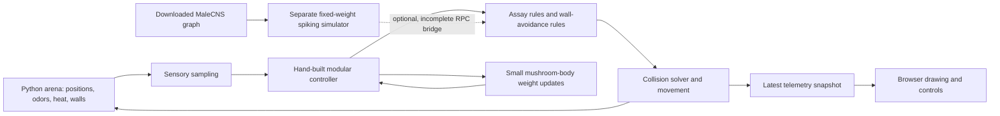
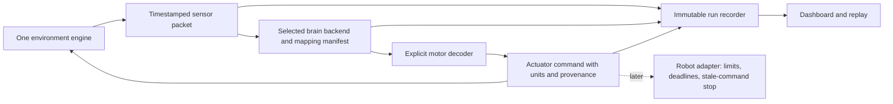

# NeuroFly rethink: what we have, what failed, and what is worth building

19 September 2026 · implementation audited at `355f50e`.

This is an evidence report and a **provisional recommendation**, not an approved
redesign. Development changes are paused while the grilling interview establishes
the intended product. All 14 experiments and the existing dashboard style stay.
The main experiment is paused, and the background research worker is stopped;
existing brains, checkpoints and datasets have been retained. The services remain
installed: these are operational pauses, not a permanent shutdown configuration.

## Assessment

The project makes sense as an open toolkit for testing how connectome-derived
controllers behave in environments. It already has useful assets: a downloaded
graph, a functioning numerical substrate, 14 environments, saved controller
instances, a dashboard and data-export machinery.

It has **not** established a reliable whole-connectome controller, biological
learning across those environments, or readiness to control physical robots.
The present animated fly is driven by a small hand-built controller. Several
impressive-looking responses are explicit behavioral rules. Fixing those rules
can improve the demonstration without bringing the downloaded brain any closer
to controlling it. That mismatch is more important than another visual polish pass.

My previous assurance was too broad. Visiting 14 pages, passing containment tests
and seeing an advancing clock do not establish correct behavior, cross-browser
reliability or stability under acceleration. Those are separate claims and need
separate evidence.

## How the project actually works

There are three controller paths, with very different meanings:

| Path | Actual computation | What learns | Used by the live roster? |
|---|---|---|---|
| Modular | Hand-built sensory, compass and motor modules; 120 Kenyon cells; explicit assay reflexes | Compact mushroom-body parameters | Yes: `ExperimentBrain` explicitly selects it |
| Connectome surrogate / RPC hybrid | Hand-built controller, optionally partially overwritten by remote graph readouts | Depends on the hand-built components; graph readout is not graph-wide plasticity | No, not the dashboard's default brain bank |
| Downloaded MaleCNS graph | Fixed-weight leaky integrate-and-fire dynamics on the prepared connectivity | No synaptic plasticity in this substrate; separate code trains an external readout | Runs separately; integration is incomplete |

Evidence: `experiment_brains.py:37`, `assay_response.py:1`,
`connectome_bridge.py:840`, `brainlab/brain.py`, `brainlab/learning.py`.

The official release is a structural map of the male fly's brain and ventral
nerve cord. The data includes connectivity; our software adds dynamical models,
stimulus encoding, decoding and a simulated body. The map does not, by itself,
specify this project's learning rule or robot controller.
[Google release](https://research.google/blog/a-connectomics-milestone-mapping-the-complete-male-fruit-fly-brain/),
[Janelia download](https://male-cns.janelia.org/download/).

The recorded local import contains 166,700 retained neuronal entries and
25,582,938 directed connections representing 124,177,617 synaptic contacts.
These different counts must not be called interchangeable numbers of synapses.
`FULL_BRAIN_TEST.md` records graph/numerical validation, not an embodied learning
result. Its 0.293 wall-seconds per 0.1 simulated seconds is a historical short CPU
measurement, not a current real-time robotics guarantee.

### What “its own learning brain” currently means

Each assay owns a separate modular brain object and saved weights. This is real
isolation, but it is not a separate copy of the full downloaded spiking network.
The checkpoint is also not a complete world snapshot: pose, every transient state
and all random-generator state are not restored as exact trajectory continuation.
The learning location must be stated explicitly: internal synapses, an external
trained decoder, or a hand-written rule are three different mechanisms.

## Failures and evidence

### High acceleration: an actual browser failure reproduced

An isolated fresh wind-tunnel daemon was started on port 18784 using unchanged
code. In the browser I selected 100× through the ordinary speed control. The
view later displayed **DISCONNECTED · FROZEN VIEW**, frozen at step **12052**,
while the process continued computing. The browser animation FPS still read 59:
a running animation loop is not proof of fresh simulation data.

Six read-only backend snapshots advanced from step 24028 to 51395, or 480.56 to
1027.90 simulated seconds, across 23.647 seconds of server-authored wall time.
That is **23.146× achieved speed**, despite the 100× label. Snapshots requested
one second apart arrived at multi-second intervals. This establishes a display/
transport responsiveness failure under load, not a numerical blow-up.

Receipts: `outputs/rethink-audit/browser-speed-100.json` and
`outputs/rethink-audit/browser-freeze.json`. The isolated process was stopped
after the audit. The user's retained brains were not used by this test.

Additional isolated smoke observations:

| Environment | Requested | Observed achieved factor |
|---|---:|---:|
| Wind tunnel | 1× | 1.00× |
| Wind tunnel | 20× | 23.67× |
| Wind tunnel | 100× | 23.78× |
| Labyrinth | 1× | 1.00× |
| Labyrinth | 20× | 21.72× |
| Labyrinth | 100× | 21.21× |

These short shared-machine observations are not calibrated benchmarks. Their
requested two-second sampling wait sometimes overshot, and the original thread
stop measurement did not assert termination after its join timeout. The separate
server-timestamp measurement above avoids using that join interval. Exact
diagnostic and caveats: `outputs/rethink-audit/timing_diagnostic.py` and
`timing_receipt.json`. Equal-step deterministic equivalence remains untested.

Mechanisms visible in code:

* Backend physics keeps `dt=0.02`, which is appropriate. But the pacing loop only
  sleeps when the remaining time exceeds 0.5 ms. At 100× a whole target tick is
  only 0.2 ms, so this behaves as an uncapped throughput request. At intermediate
  speeds it can also overshoot the requested rate (`neurofly_daemon.py:170`).
* The simulation, snapshots, SSE and commands share a lock. A tight loop can
  delay other work. Shared-lock scheduling/CPU contention is a strong hypothesis
  for the observed freeze; profiling is required before attributing the exact cause.
* Private streaming targets 30 frames/s, public streaming 10. At a true 100×,
  even perfect private streaming spans 3.33 simulated seconds between frames.
  Drawing straight between those sparse positions can hide turns and wall contacts.
* Local browser preview changes its integration timestep at 50× and can discard
  accumulated time. It is a separate simulation, not an interchangeable scientific
  implementation of the backend. The roster should share one scientific engine.

### Firefox: unresolved, not passed

Firefox 156.0 is installed. This session's browser-control surface exposes only
the in-app browser, so I could not directly reproduce the user's Firefox failure.
Static review found no proven Firefox-specific API incompatibility. No Firefox
pass or fix is claimed.

Confirmed cross-browser failure mechanisms still present: an uncaught exception
before the next `requestAnimationFrame` stops rendering; the SSE handler silently
catches packet/application errors. Python-only CI cannot detect these failures.
The untracked Firefox test script blocks live POST commands and is therefore not
evidence that connected switching works. Preserve it as existing work, but do not
cite it as a release gate without reviewing its scope.

At narrow widths the current CSS requires at least 1080px and permits horizontal
scrolling (`training.css` overrides the older inline CSS). Controls can extend
outside the visible viewport. This is a usability issue, not a proven Firefox cause.

### Wall sticking: the tests did not answer the user's question

Containment means “inside the permitted geometry,” not “makes useful progress.”
The current audit can miss repeated brief stalls, near-wall oscillation, low-speed
wall orbiting, and stationary states with zero commanded speed. One test comment
says the animal must move, while its assertion only checks executed step count
(`tests/test_containment_all_paradigms.py:52`). The 42-run behavior audit checks
finite values and bounded jumps; it does not certify goal attainment or learning.

Wall avoidance is partly an engineered turn override and partly collision
correction. Any future graph-driven result must log how much action came from
the graph, decoder, engineered controller and collision solver. Otherwise a
successful wall escape can be wrongly credited to the connectome.

### Other observed measurement problems

Pausing the main wind tunnel through the browser changed its visible progress
from a measured value to “Not observed.” Pause calls `_assemble_telemetry({})`,
which builds empty assay metrics (`neurofly_daemon.py:267–275,452–458`). A pause
should retain the last valid observation and mark its clock as paused.

On the high-speed disconnect, the frozen view reverted some metric labels/graphs
to preview semantics despite retaining the last pose. “Frozen view” must preserve
the entire measurement snapshot, not merely coordinates.

## Full-graph integration barriers

These are concrete provenance/control problems, not reasons to abandon the data:

1. The RPC visual mapping splits retinal rows in half instead of consulting side
   annotations. Inspection of the installed tables found the nominal left input's
   first 100 neurons comprised 51 right-eye and 49 left-eye cells; the nominal
   right input comprised 63 right-eye and 37 left-eye cells. Both channels mix eyes.
2. The bridge computes surrogate commands first, then overwrites some channels
   only if graph rates are positive. A silent graph can therefore leave surrogate
   walking active. A lesion experiment cannot be interpreted under that rule.
3. Missing graph files can select a synthetic graph, and RPC errors can leave the
   surrogate running. A scientific controller must not silently change identity.
   This is immediately relevant: the active worktree's default graph path is
   absent. The real graph is in the root checkout at
   `/home/avg-usr/Documents/ChatGPT/flybrain/outputs/brainlab/malecns_v1/graph.npz`.
   Starting the RPC server with defaults from the active worktree would select
   the synthetic fallback. The mapping audit explicitly used the real graph and
   verified its neuron IDs against the normalized metadata.
4. Hard-coded descending-neuron indices match their advertised cell types in the
   installed graph—this was checked. They still lack robust graph-version and
   hemisphere validation. Do not report them as definitely incorrect indices.
5. Some declared inputs, including danger odor/proprioception, are not actually
   injected by the RPC step. Heat, social and gap tasks need explicit supported
   sensory pathways; connecting the RPC endpoint does not implement them.

Evidence: `brainlab/cosim_server.py:49–83,127–139,168–205`,
`connectome_bridge.py:840–855`, `connectome_client.py:72–103`.
Reproducible metadata audit: `outputs/rethink-audit/audit_connectome_mapping.py`
and `outputs/rethink-audit/connectome-mapping-receipt.json` (paths, hashes, stable
neuron IDs, cell-type checks and retinal membership).

## Recommended direction, pending your decisions

Keep all 14 environments as a **benchmark roster**. Label each controller/assay
combination separately: geometry available, sensory mapping available, motor
response tested, learning tested, or mechanism unimplemented. One global green
“working” badge cannot express those distinctions.

Build one auditable graph-mediated sensor→neural activity→motor loop before
adding general task learning. My candidate is an optomotor yaw experiment with
left/right and contrast manipulations. This is a tractable investigation, not a
promise that the current graph dynamics will reproduce the expected response.

The causal test matters: suppressing the selected graph output must change or
remove its commanded motor contribution. Compare with a disconnected/sham graph
and the modular baseline under identical inputs. If all three behave the same,
the demonstration has not shown useful connectome control.

Use explicit, independently testable components:

For robotics, first replay recorded sensors into simulated actuators. A physical
robot must operate on wall-clock deadlines; it cannot assume the graph will keep
up or that requesting 100× makes it faster. Retain a bounded actuator interface
and a stale-command stop. Fly sensory encoding and robot motors need an explicit
mapping, including units, coordinate frames and uncertainty.

The code already has MIT licensing, NOTICE, upstream attribution, data hashes
and pinned requirements. Preserve these foundations. Remaining sharing work
includes a canonical entry point, clean-clone reproducibility, portable startup,
browser evidence and clear capability claims. No Git remote is configured; this
audit does not publish anything.

## Decision tree for the grilling interview

Settled: preserve the roster and visual style; pursue more real connectivity;
make the repository useful to others; stop implementing patches during review.

Current frontier, awaiting your answers:

* **Primary success criterion:** connectome research, reliable robot behavior,
  or educational simulation? Recommendation: connectome-controller research with
  engineered controllers explicitly retained as comparison baselines.
* **Resource envelope:** prove a baseline on this computer before spending,
  available GPU/cloud budget, or a longer collaborative effort? Recommendation:
  profile locally before choosing hardware.

Those decisions unlock the next round: acceptable engineered motor decoding,
what “learning” must mean, the first causal assay, fidelity versus throughput,
target robot interfaces and the public release gate. We have not silently settled
those branches. A credible failure is a valid research result; it is not necessarily
an acceptable robot-control product. You need to choose which result comes first.

The executable handoff is [CLAUDE_IMMEDIATE_PLAN.md](CLAUDE_IMMEDIATE_PLAN.md).
Implementation of the proposed architecture remains on hold until the interview
reaches a shared understanding.
