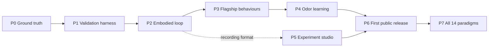

# Project NeuroFly: Roadmap

**Version**: 2.0 · **Date**: 2026-09-24 · **Status**: approved by the owner on 2026-09-24
**Replaces**: [`docs/archive/ROADMAP_v1.0.md`](archive/ROADMAP_v1.0.md)

This plan turns NeuroFly into a research tool people can trust and a
citizen-science instrument people can run at home. It starts by resetting the
claims to what the receipts prove, then earns each capability back with a
preregistered test.

## Principles

- **Accuracy first.** float64 brain, physics dt 0.1 ms, noslip on. A speed-up is
  accepted only when it is bit-identical or proven equivalent. Lower-fidelity
  modes are opt-in and report their accuracy cost.
- **Receipts over docs.** A capability exists only when a v3 receipt with a
  preregistered verdict backs it.
- **Real learning.** Brain training means plasticity inside the connectome.
  Mushroom-body odor learning comes first.
- **Science for the people.** Local installs, curated runs to start,
  tweak-and-run experiments, open citable data.

## Decisions this plan rests on

Settled with the owner on 2026-09-24.

| Question | Decision |
|---|---|
| Audience | Both a research tool for labs running their own experiments and a public showcase that popularises citizen research. |
| Brain training | Real synaptic plasticity inside the connectome. Decoder tuning is optional and later. |
| Where it runs | Server-side Python on the user's own machine, streamed to a browser dashboard. The Ryzen is the reference install. |
| Hosting | None for now. Local installs only. Hosting gets decided after the flagship paradigms pass. |
| Docs | Reset the capability matrix and roadmap to what receipts prove, before any new features. |
| Citizen role | Pick a paradigm, change a few parameters (stimulus, odor, silence a neuron), run it. Curated runs are the way in. |
| Validity | Both: behaviour matches published fly numbers within a declared tolerance (the gate), and firing rates stay physiological (the sanity check). |
| Real time | Not required. Full accuracy always. Runs finish, then replay at 1x. |
| Paradigm scope | Three flagships first (optomotor, looming escape, T-maze odor learning), then all 14. |
| Modular controller | Kept as a researcher baseline, hidden from citizens. |
| Default dynamics | v3 everywhere. v1 stays as a historical option only. |
| First plasticity | Mushroom-body odor conditioning in the T-maze. WP6 heading map (ER→EPG) second. |
| Deadline | None. Phase by phase, gate by gate. |
| Data | Every run is open, citable data with full provenance from the first public release. |

## Where we start (checked 2026-09-24)

| Area | State | Evidence |
|---|---|---|
| Brain on GPU | Done, in review. v3 only, 0.40x real time on a GTX 1660 Ti vs 0.041x on the Ryzen CPU. Rate correlation 0.9986 with the CPU reference. | PR #2 |
| Body speed | Done, in review. Compiled FlyGym controller, bit-identical, 0.648x on the Ryzen. | PR #3 |
| Brain + body loop | Not measured. Estimated about 0.25x run back to back. | none yet |
| Optomotor steering | Unproven on v3. The only POSITIVE verdict is from v1 (runaway, about 1e6 spikes/s). The v2 re-run disagreed. No v3 receipt exists. | `docs/receipts/wp5_optomotor.json` |
| Closed-loop receipts | Weak: 1 s runs on the v1 controller. | `docs/receipts/connectome_closed_loop_*.json` |
| Capability matrix | Overclaims "Validated" for optomotor, open arena and the sandbox, and "Active" learning in several paradigms. | `docs/CAPABILITY_MATRIX.md` |
| Live daemon | Fix in review. Defaults to v1 (CPU only). Its "v3" mode ran v3 equations on v1 weights because the v3 transmitter policy was skipped, so any daemon or closed-loop result labelled v3 is suspect. | PR #4 |
| Mushroom-body learning | Modular only (hand-built 120-KC model). Nothing is wired into the connectome. | `circuit.py` |

The table above is the snapshot the plan was approved on and is kept as it was.

### Progress since approval (updated 2026-09-24)

| Area | State now | Evidence |
|---|---|---|
| PRs #1 to #4 | Merged. v3 with its transmitter policy is the default for the daemon (PR #4) and the whole library (PR #10); the GPU is used when CUDA is present. | `brainlab/brain.py`, `brainlab/graph_identity.py` |
| Capability matrix and README | Reset to receipts (PR #6). | `docs/CAPABILITY_MATRIX.md` |
| Ryzen speed receipts | Full daemon on true v3: 0.43x GPU, 0.043x CPU. Brain only: 0.38x GPU, 0.042x CPU. GPU vs CPU rate correlation 0.9986. | PR #11, `docs/receipts/ryzen/` |
| Recording and replay | Deterministic `.nfrec` recordings with 1x replay; the brain backend is recorded. | PRs #8, #13 |
| Validation harness | `neurofly validate` with preregistered specs and verified firing-rate bounds. | PRs #9, #15 |
| P1 optomotor on v3 | Run v3-1 **FAILED**: behaviour 7/7, physiology 5/7 (HS above the 50 Hz ceiling). Spec v3-2 was declared before its rerun; the rerun is pending on the Ryzen. | `docs/receipts/validation/optomotor-yaw-v3-1.md`, PR #16 |
| Brain + body loop benchmark | Still not measured. | none yet |

## Phase map

Each phase ends at a gate that needs explicit owner sign-off. Phases run in
order, except P5, which starts once P2 ships the run recording format and
proceeds alongside P3 and P4.

---

## P0: Reset to ground truth

**Goal**: make the repo say only what it can prove, land the speed work
already done, and put the live fly on v3 and the GPU.

**Deliverables**
- Rewrite `docs/CAPABILITY_MATRIX.md` from receipts. Each cell is Validated (v3
  receipt with a verdict), Mapped (wired, untested on v3), or Unmapped. The v1
  results move to a history column.
- Replace this roadmap (done) and make the README claims match the matrix.
- Merge PRs #1, #2, #3 and #4 after review.
- Switch the daemon default to v3 with the v3 transmitter policy applied
  (PR #4), using the GPU when a CUDA device is present and the CPU otherwise.
  v1 is kept behind a flag and labelled historical.
- Audit every daemon and closed-loop receipt labelled v3. They ran v3 equations
  on v1 weights, so they're relabelled invalid and re-run, or retired. From now
  on each receipt records the graph hash after the policy is applied.
- Record a brain-plus-body benchmark receipt on the Ryzen (x real time, GPU
  memory, CPU load), and a determinism check that the same seed gives the same
  trajectory.

**Depends on**: nothing.

**Risk**: the live fly may stop steering once v1 is off. That is the correct
outcome, and the dashboard should say "connectome, v3, steering unvalidated".

**Gate 0 exit criteria**
- Every "Validated" in the matrix links to a v3 receipt.
- CI is green on master with #1 to #4 merged.
- No receipt labelled v3 was produced by the old daemon path.
- The live dashboard runs v3 on the GPU, checked in the browser per `AGENTS.md`.
- A full-loop benchmark receipt exists.

## P1: Validation harness and the v3 question

**Goal**: build the machinery that turns "does the fly do X?" into a
preregistered, repeatable verdict, then answer the question the old Gate 1
never answered: does the v3 connectome steer?

**Deliverables**
- A benchmark spec format (JSON, hashed before the run): paradigm, metric,
  published target with citation, tolerance, seeds, conditions, controls and
  the verdict rule.
- A runner, `neurofly validate <spec>`, that runs every condition headless and
  writes a receipt with graph hash, code SHA, seeds and verdict.
- Physiology sanity checks for every run: spontaneous rate distribution,
  fraction of silent and saturated neurons, and DN rates at baseline. These are
  reported beside every behavioural verdict.
- Re-run v3 probes A, B and C on the GPU backend.
- The WP5 confirmatory optomotor run on v3 (6 seeds × 4 conditions: intact,
  DNa02-silenced, sham, shuffled), reported as positive, null or negative.

**Depends on**: P0.

**Risk**: v3 optomotor comes back null. This is the biggest risk in the plan.
The response is a diagnosis pass first: check the left/right visual input
mapping, T4/T5 drive strength, the DNa02 readout and decoder gain. Each fix
gets its own preregistered retest, with no tuning to the result.

**Gate 1 (owner decides)**
- Positive: go on to P2 with the connectome as the steering controller.
- Null or negative: choose between a bounded diagnosis loop, or going ahead
  with the connectome labelled "does not yet steer" while the harness keeps
  value for researchers.

## P2: Embodied loop at full fidelity

**Goal**: the GPU brain drives the FlyGym body in a deterministic multi-rate
loop, and every run is saved as a replayable recording.

**Deliverables**
- A co-sim runner: 2 ms brain steps (20 × 0.1 ms LIF substeps), 0.1 ms MuJoCo
  substeps, and a sensory encoder at 500 Hz.
- DN decoders for DNa02 (yaw), DNp09 (forward), MDN (reverse) and GF (takeoff),
  plus leg-load feedback into the brain.
- Brain and body overlapped on separate threads (GPU brain, CPU body). This is
  an exact speed-up with the same results, and could take the loop from about
  0.25x toward the brain's 0.40x.
- A run recording format: joint angles, contacts, pose, DN rates, a
  spike-raster summary and full provenance. The browser replays it at 1x.
- A local run queue, so experiments run one after another and people watch the
  recording afterwards.

**Depends on**: P1 harness.

**Risk**: running brain and body concurrently must not change the order of
data flow. It is accepted only with a bit-identical trajectory against the
sequential loop.

**Gate 2 exit criteria**
- A 10 s embodied run replays bit-identically from its seed.
- The modular and connectome controllers both walk, with video and telemetry.
- A throughput receipt for the full loop on the Ryzen.

## P3: Three flagship behaviours

**Goal**: show three innate behaviours against published fly data, each with
its own preregistered spec, before anything learns.

**Deliverables**
- **Optomotor**, embodied: turning index vs drum speed and direction, with
  DNa02 silencing as the causal control.
- **Looming escape**: the LC4/LPLC2 → giant fiber pathway. Metrics are escape
  probability and latency vs looming speed (l/v), matched to published curves,
  with GF silencing as the control.
- **T-maze odor valence (untrained)**: the innate attraction and avoidance
  baseline for the odors P4 will use.
- A validation page per paradigm: spec, result, plots, controls and known limits.

**Depends on**: P2.

**Risk**: mapping rendered stimuli onto photoreceptor and ORN inputs involves
modelling choices. Each one is declared in the spec, and alternatives are
tested as preregistered variants, never picked after seeing the result.

**Gate 3 (owner decides)**
- Each flagship is marked pass, partial or fail, with its receipt.
- Decide whether the T-maze baseline is solid enough to train on.

## P4: Brain training (mushroom-body odor learning)

**Goal**: a fly that learns to avoid an odor paired with punishment, through
plasticity in its own connectome.

**Deliverables**
- A WP7 spec in the style of [`WP6_PLASTICITY_SPEC.md`](WP6_PLASTICITY_SPEC.md):
  the plastic edge set (KC → MBON synapses in the compartments innervated by
  PPL1 dopaminergic neurons), the rule (dopamine-gated depression of recently
  active KC synapses), and every parameter with its source or marked as an
  assumption.
- Wire the pathway: ORN → PN → KC odor coding, a punishment input onto PPL1
  DANs, and MBON output into the steering readout.
- A protocol modelled on classic T-maze aversive conditioning: train with CS+
  paired with punishment and CS− alone, then test the choice. The metric is the
  performance index against published values cited in the spec.
- Controls: unpaired presentation, DANs silenced, plasticity off, and a
  shuffled graph.
- A GPU plasticity kernel with the same parity rules as the static brain,
  checked against a CPU reference.
- Then WP6 (the ER→EPG heading map) through the same pipeline.

**Depends on**: P3 (T-maze baseline) and the P1 harness.

**Risks**
- Learning rates and eligibility windows are partly unknown. They are declared
  as hypotheses, a small preregistered sweep is allowed, and the result is
  reported as "learning under assumptions X", not as a biological claim.
- Training plus test is minutes of simulated time per fly, so each condition
  set is an overnight batch.

**Gate 4 (owner decides)**
- Learning verdict with controls: positive, null or negative.
- Whether learning is headline-ready for the first public release, or ships
  labelled experimental.

## P5: Experiment studio (parallel with P3 and P4)

**Goal**: the browser experience that makes this a citizen-science tool and the
API that makes it a research tool, both built on the P2 recording format.

**For citizens**
- A gallery of curated runs shipped with the install: watch the fly, its brain
  activity, and an explanation of what's happening.
- An experiment builder: pick a paradigm, change a few parameters (stimulus
  speed, odor, silence a named neuron type), then queue it.
- Side-by-side replay (intact vs silenced) to answer "what does this neuron do?"
- Badges on each paradigm (Validated, Mapped or Exploratory) taken straight
  from the matrix.

**For researchers**
- A Python API and CLI for headless batches, with experiment specs as files.
- The modular controller as a baseline backend (hidden from the citizen UI).
- Export to open formats (Parquet or NWB, chosen in this phase) with provenance.

**Risk**: the UI outruns the science. A paradigm shows as Validated only once
its gate has passed. Browser verification follows `AGENTS.md`.

**Gate 5 exit criteria**: a non-expert can install, watch a curated run, run a
silencing experiment and compare it, all without the CLI. Tested with at least
one real person.

## P6: First public release

**Goal**: something a stranger can install on their own machine and cite.

**Deliverables**
- One-command install plus `neurofly download-data`, with GPU detection and the
  CPU path documented as about 10x slower.
- A hardware page with measured numbers: NVIDIA GPU recommended (GTX 1660 Ti is
  the reference), and the RAM floor measured, not guessed.
- A clean-clone test on a second machine that passes.
- `CITATION.cff`, a DOI for the release, and a public dataset of the validation
  receipts and curated runs.
- Docs written for two readers: a researcher guide and a citizen guide.

**Depends on**: P4 and P5.

**Risk**: most people lack an NVIDIA GPU. Curated runs work on any machine,
since replay needs no simulation.

**Gate 6 (owner decides)**
- Publish, or hold for another iteration.
- Revisit hosting: a public gallery and small queue, or stay local-only.

## P7: All 14 paradigms

**Goal**: extend validation to the rest of the matrix, batched by shared
sensory pathway, each paradigm through the same spec, run and gate.

| Batch | Paradigms | Shared work |
|---|---|---|
| A · Visual | Buridan, visual operant | Reuses the P3 visual ingress. Buridan brings in WP6 heading. |
| B · Olfactory and wind | Y-maze, wind tunnel, courtship | Reuses the P4 olfactory ingress. Adds JON/WED wind input and P1 pursuit. |
| C · Thermal and body | Heat-maze, gap crossing, circadian | Thermosensory ingress and leg proprioception. Circadian needs long runs. |
| D · Composite | Open arena, labyrinth, multisensory sandbox | Validated only after A to C, as integration tests. |

**Gate per batch**: the matrix updates only from receipts. Null results are
published too.

---

## Top risks

| Risk | Impact | Response |
|---|---|---|
| v3 connectome doesn't steer | Weakens the showcase story | Bounded diagnosis in P1, preregistered retests, publish the null. The tool and harness still serve researchers. |
| Plasticity parameters unknown | Learning result depends on assumptions | Declare the assumptions, run a small preregistered sweep, word the claims to match. |
| Throughput about 0.25 to 0.4x | Batteries take hours | Queue and replay, overnight batches, exact speed-ups only. |
| 6 GB VRAM on the 1660 Ti | Limits batch or multi-fly runs | Measure in P0. Plasticity state is small (0.012% of edges for WP6). |
| Docs drift into overclaiming again | Loss of credibility | A CI check that every Validated matrix cell points to an existing receipt. |
| Citizens lack GPUs | Small active audience | Curated replay works everywhere. Hosting decided at Gate 6. |

## Compute budget (estimates)

Loop speed is estimated from brain 0.40x and body 0.648x run back to back
(about 0.25x). P0 replaces this with a measurement.

| Job | Sim time | Wall time at 0.25x | v1.0 roadmap estimate |
|---|---|---|---|
| One 10 s citizen experiment | 10 s | ≈ 40 s | ≈ 35 min |
| WP5 optomotor, 24 runs × 8 s | 192 s | ≈ 13 min | ≈ 11 h |
| Probe C, full graph, brain only (0.40x) | 2 s | ≈ 5 s | ≈ 7 min |
| Odor conditioning, 1 fly (est. 5 min train + test) | 300 s | ≈ 20 min | n/a |
| Conditioning, 4 conditions × 12 flies | 4 h | ≈ 16 h | n/a |

## Parked and cut

**Parked until a gate reopens it**: hosting a public gallery or queue (Gate 6);
decoder or controller training on a fixed connectome; opt-in lower-accuracy
modes (fp32, larger physics dt, noslip off), only on owner request with the
accuracy cost measured; buying a faster GPU.

**Cut**: real-time simulation as a requirement; in-browser (WebGPU)
simulation; any capability claim without a v3 receipt; v1 dynamics as a
default anywhere.

## Standing rules (from `AGENTS.md` and the v1.0 roadmap)

1. Stop at every phase gate for explicit owner confirmation.
2. Never delete a repository, worktree, checkout, branch, or evidence bundle.
3. Browser-facing changes are verified in the running browser.
4. Conflicts escalate; they are never settled on the spot.
