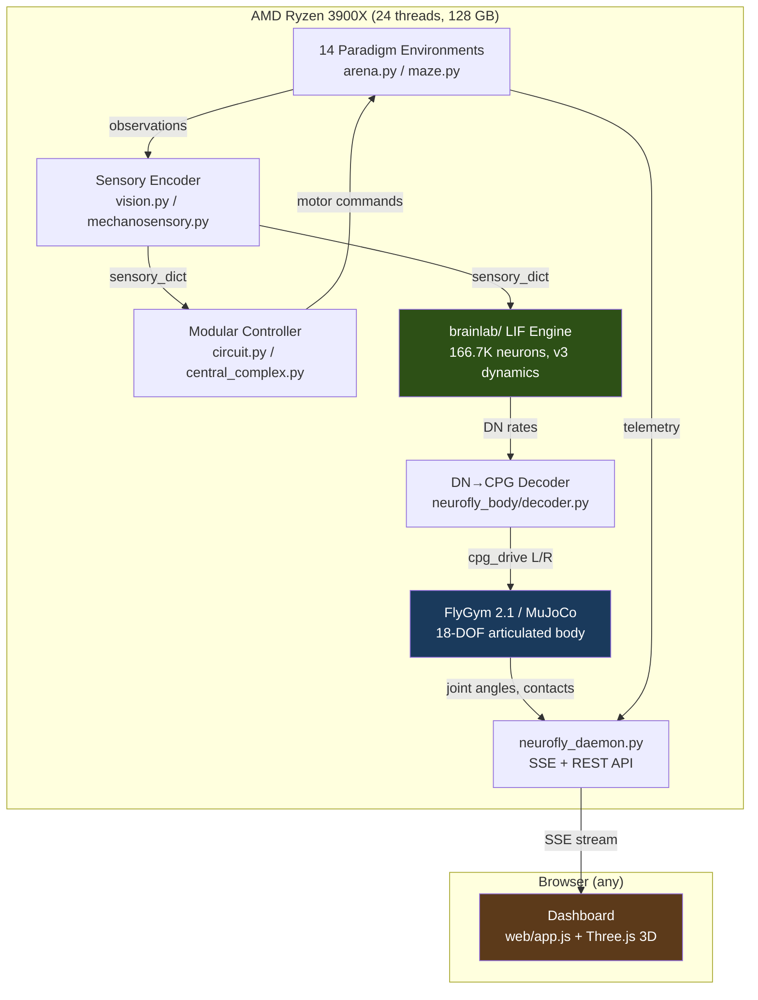
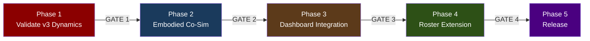

# Project NeuroFly — Consolidated Product Roadmap

**Version**: 1.0 · **Date**: 2026-09-22 · **Branch**: `product/consolidated-roadmap`
**Status**: DRAFT — awaiting owner approval before execution begins.

---

## Preamble

This document is the **single authoritative roadmap** for Project NeuroFly.
It consolidates and supersedes all prior plan documents (listed in
[`docs/SUPERSEDED_PLANS.md`](SUPERSEDED_PLANS.md)). Where those documents
conflict, this one governs. Where they contain valid technical findings or
evidence, they are referenced by citation rather than duplicated.

The prior plans were written by different AI agents at different times and
contained contradictions (e.g. claiming the connectome controls the fly while
simultaneously documenting that it does not). This plan resolves those
contradictions by adopting the most honest assessment
([`docs/NEUROFLY_RETHINK.md`](NEUROFLY_RETHINK.md)) as the ground truth and
the owner-approved co-simulation architecture
([`docs/FULL_CONNECTOME_COSIM_PLAN.md`](FULL_CONNECTOME_COSIM_PLAN.md)) as
the product direction.

---

## Product Definition

### What NeuroFly Is

An open-source, server-side whole-brain co-simulation platform that couples the
**MaleCNS v1.0 connectome** (166,700 neurons, 25.6M synapses) to an
**articulated 3D fruit fly body** (FlyGym/NeuroMechFly v2 + MuJoCo) and
exposes it through an interactive browser dashboard with real-time
telemetry and 14 neuroethology paradigms.

### Who It's For

Computational neuroscientists, neuroethologists, and advanced students who want
to:
- Run closed-loop experiments on a connectome-derived controller
- Compare connectome-driven vs. hand-built (modular) baselines
- Explore the 14 classical *Drosophila* paradigms in simulation
- Export reproducible, provenance-tracked experimental data

### What "Done" Looks Like

A clean `git clone` on a Linux machine with ≥32 GB RAM and Python 3.12+ can:
1. Download the MaleCNS dataset (automated, verified)
2. Install dependencies (`pip install -e ".[body]"`)
3. Start the daemon (`neurofly run`)
4. Open the dashboard in a browser and switch between modular and connectome
   controllers across all 14 paradigms
5. Export run data with full provenance (graph hash, controller version, seeds)

### Distribution

- **Now**: Local development only. Git repository with no remote.
  Backup via snapshot bundles to `/mnt/hpserver-storage/neurofly/snapshots/`.
- **Phase 5**: Public git hosting (GitHub). `pip install neurofly`.
  No paid compute. MIT license (already in place).

### What NeuroFly Is Not

- Not a biological validation of the connectome's learning capacity
- Not a real-time robotics controller
- Not a replacement for Brian2 or NEURON for detailed biophysics

---

## Current State (Ground Truth)

| Component | Status | Evidence |
|---|---|---|
| 14 paradigm environments | ✅ Working | 158 tests passing |
| Modular controller (120 KC, compass, CPG) | ✅ Working | Drives the dashboard fly |
| Browser dashboard + SSE telemetry | ✅ Working | Port 8769/8780 |
| `brainlab/` LIF spiking engine (v1/v2/v3) | ✅ Steps full graph | ~0.3× real-time on CPU |
| `neurofly_body/` FlyGym adapter | ✅ Skeleton exists | 332 lines, `FlyGymBody` + `DNa02CPGDecoder` |
| Connectome controlling the fly | ❌ Not working | WP5 optomotor: NULL result; causal claim withdrawn |
| v3 dynamics (PSP-preserving calibration) | ✅ Declared & implemented | Committed at `a544bfa`; marginally subthreshold (−45.13 mV) |
| v3 confirmatory optomotor run | ❌ Not done | Blocked on owner decision (see Phase 1) |
| Internal synaptic plasticity (WP6) | ❌ Spec only | Blocked by biophysics validation |
| FlyGym installed | ❌ Not in venv | Available on PyPI as `flygym==2.1.0` |
| 3D dashboard viewport | ❌ Not started | — |
| Clean-clone reproducibility | ❌ Not done | — |
| Git remote | ❌ None | Manual snapshot sync |

### The Blocking Scientific Problem

The LIF dynamics v2 produced a suprathreshold network fixed point (−26.75 mV
vs −45 mV threshold) because the conductance calibration inadvertently weakened
inhibition by 3×. The v3 recalibration (per-sign PSP preservation + aminergic
neurons lose fast weight) brings the fixed point to −45.13 mV — marginally
subthreshold — but has **not been validated on the full graph in a confirmatory
run**. This is the first gate.

---

## Architecture



### External Dependencies (Verified)

| Package | Version | Role | PyPI | License |
|---|---|---|---|---|
| `flygym` | 2.1.0 | Articulated body + HybridTurningController | ✅ | MIT |
| `mujoco` | 3.9.0 | Physics engine (required by flygym) | ✅ | Apache-2.0 |
| `brian2` | 2.10.1 | Already installed; test-only dependency | ✅ installed | CeCILL-2.1 |
| `numpy` | ≥2.0 | Core numerics | ✅ installed | BSD |
| `numba` | ≥0.65 | JIT for brainlab kernel | ✅ installed | BSD |

### Reference Projects (Verified to Exist)

| Project | Author | What We Learn From It |
|---|---|---|
| [`philshiu/Drosophila_brain_model`](https://github.com/philshiu/Drosophila_brain_model) | Shiu et al. (Nature 2024) | LIF parameters, validation methodology |
| [`NeLy-EPFL/flygym`](https://github.com/NeLy-EPFL/flygym) | Ramdya Lab, EPFL | Body model, CPG controller, MuJoCo integration |
| [`erojasoficial-byte/fly-brain`](https://github.com/erojasoficial-byte/fly-brain) | Community | Brain-body bridge architecture pattern |
| [`ZeroXClem/closed-loop-fly`](https://github.com/ZeroXClem/closed-loop-fly) | Community | WebGPU in-browser approach (reference, not adopted) |

---

## Phase Structure

Each phase has a **gate** that requires explicit owner confirmation before the
next phase begins. Within a phase, steps proceed without user input.



---

## Phase 1 — Validate v3 Dynamics & Unblock the Graph

**Goal**: Prove or disprove that the v3-calibrated full connectome can produce a
measurable, causal sensorimotor response. This is the scientific foundation
everything else depends on.

**Estimated effort**: 1–2 sessions. Primarily compute-bound (graph simulation).

### Step 1.1 — Run v3 Probes

**Role**: Simulation engineer (automated script execution)

Run the predeclared probes from [`docs/LIF_DYNAMICS_SPEC.md`](LIF_DYNAMICS_SPEC.md) §6.8:

| Probe | What It Tests | Pass Criteria |
|---|---|---|
| Probe A (2 neurons) | Unitary PSP calibration | v3 IPSP within 1% of v1 IPSP |
| Probe B (2,000 random) | Self-sustained state | Report rate; compare v1/v2/v3 |
| Probe C (full graph) | Quiet baseline + responsiveness | Q1: gray rate < 10⁵ sp/s, DNa02 < 20 Hz; R1: rate > 0 during stim, |L−R| ≥ 1 Hz |

**Files**: `brainlab/engine.py`, `brainlab/brain.py`, existing probe scripts under
`scripts/` and `docs/receipts/`.

**Output**: `docs/receipts/lif_dynamics_v3.json` with all measurements.

### Step 1.2 — Confirmatory Optomotor Run (conditional on Q1+R1 passing)

**Role**: Simulation engineer

Execute the WP5 preregistered protocol (`docs/wp5_optomotor_prereg.json`):
6 seeds × 4 conditions (intact, DNa02-silenced, sham, shuffled) with
`--dynamics v3`. Report the turning index beside v1 and v2 numbers.

**Output**: Receipt in `docs/receipts/wp5_v3_optomotor.json`.
Verdict: positive, null, or negative — reported honestly.

### Step 1.3 — Install FlyGym in the Project Venv

**Role**: Environment engineer

```bash
/home/avg-usr/Documents/ChatGPT/flybrain/.venv/bin/pip install "flygym==2.1.0"
```

Verify import and basic stepping:
```python
from flygym import Simulation
from flygym.compose import FlatGroundWorld
sim = Simulation(FlatGroundWorld(), timestep=0.0001)
sim.reset()
sim.step({})  # empty action → default pose
print(f"FlyGym {sim.__class__.__module__} working, t={sim.time}")
```

Run existing tests to confirm no regressions: `pytest tests/ -q`.

**Output**: Updated `requirements-lock.txt` with pinned flygym+mujoco versions.

### Gate 1 — Owner Decision

Present:
- v3 probe results (pass/fail on Q1, R1, R2)
- v3 optomotor verdict (if run)
- FlyGym installation confirmation
- Remaining test count

**Owner decides**:
1. If v3 probes fail: stop scientific claims, proceed with modular-only
   embodiment (Phase 2 still works — it just uses the modular controller)
2. If v3 probes pass but optomotor is null: proceed with embodiment; the
   connectome backend is available but does not yet steer
3. If v3 optomotor is positive: proceed with full connectome embodiment

---

## Phase 2 — Embodied Co-Simulation (Server-Side)

**Goal**: Connect the spiking brain (or modular controller) to FlyGym's
articulated body so the fly walks with real joint physics. This is the core
architecture from
[`FULL_CONNECTOME_COSIM_PLAN.md`](FULL_CONNECTOME_COSIM_PLAN.md).

**Estimated effort**: 2–4 sessions. Primarily integration work.

### Step 2.1 — Validate and Extend `neurofly_body/`

**Role**: Integration engineer

The embryonic `neurofly_body/` package already has:
- [`interfaces.py`](../neurofly_body/interfaces.py): `NeuralBackend` and `BodyBackend` protocols
- [`decoder.py`](../neurofly_body/decoder.py): `DNa02CPGDecoder` (DN rates → CPG drive)
- [`flygym_body.py`](../neurofly_body/flygym_body.py): `FlyGymBody` wrapping FlyGym 2.1's
  `Simulation`, `FlatGroundWorld`, and `HybridTurningController`

Tasks:
1. **Add `DNp09` forward-velocity channel** to decoder: `v_fwd = v_base + β × R_DNp09`.
   Currently only DNa02 yaw is decoded. Forward velocity is needed for plume tracking.
2. **Add `MDN` backward-walking toggle**: when MDN rate exceeds threshold, reverse
   CPG phase coupling direction.
3. **Add `GF` escape trigger**: ballistic takeoff when DNp01 rate exceeds threshold.
4. **Wire ascending sensory feedback**: extract ground-contact forces from
   `FlyGymBody.observe()` → feed back as Campaniform Sensilla input to the brain.
5. **Write `neurofly_body/runner.py`** (referenced in `__init__.py` but missing):
   the `EmbodiedConfig` dataclass and `run_embodied()` CLI entry point.

**Acceptance**: A headless 1000-step co-simulation with the modular controller
completes without error, producing a JSON telemetry file with joint angles,
contacts, and body position.

### Step 2.2 — Multi-Rate Co-Simulation Loop

**Role**: Systems engineer

The brain and body run at different rates:
- Brain (brainlab LIF): dt = 0.1 ms (10 kHz)
- Body (FlyGym/MuJoCo): dt = 0.1 ms (10 kHz, matching flygym default)
- Sensory encoder: dt = 2 ms (500 Hz, matching brainlab `step()` default)
- Telemetry export: dt = 20 ms (50 Hz)

Implement in `neurofly_body/runner.py`:
```
for each brain_step (2 ms = 20 × 0.1 ms LIF substeps):
    1. Encode sensory observations from last body state
    2. brain.step(sensory_dict, duration_ms=2.0) → DN rates
    3. decoder.decode(DN_rates, dt_ms=2.0) → cpg_drive
    4. body.step(cpg_drive, substeps=20)  # 20 × 0.1 ms = 2 ms
    5. Every 10th brain_step: emit telemetry snapshot
```

**Acceptance**: Deterministic replay — same seed, same initial state → identical
trajectories at different wall-clock speeds (1×, 5×, max).

### Step 2.3 — Wire Sensory Ingress for the Optomotor Paradigm

**Role**: Neuroscience engineer

Map the optomotor drum's visual stimulation into the graph's sensory neurons:
1. Use the existing `vision.py` 72-ray visual model
2. Map rays to optic-lobe columnar entries (R1–R6 → lamina → medulla → T4/T5)
   using the neuron-ID annotations from `brainlab/io_map.py`
3. Verify left-eye and right-eye neuron assignments against MaleCNS side
   annotations (the WP5 audit found mixing; use the corrected mapping from
   commit `ca7b71b`)

**Acceptance**: With the optomotor drum rotating clockwise, the left-eye visual
neurons receive higher contrast change than the right. Measurable in a
1-second probe.

### Step 2.4 — Smoke-Test: Modular Controller Walks in FlyGym

**Role**: Integration engineer

Run the full co-sim loop with `brain_backend='modular'`:
- Open arena, 10 seconds simulated time
- The fly should walk forward with a tripod gait
- Export video (FlyGym renderer, 25 fps)

**Acceptance**: Video shows articulated walking. Joint angles are physiological
(within FlyGym's documented ranges). Body moves forward > 5 mm in 10 seconds.

### Step 2.5 — Smoke-Test: Connectome Controller in FlyGym (if v3 passed)

**Role**: Simulation engineer

Same as 2.4 but with `brain_backend='connectome-fixed'` and `--dynamics v3`.
Record DN rates alongside joint angles.

**Acceptance**: The fly moves (or doesn't — reported honestly). DN rates are
logged. Controller identity bar says `connectome (MaleCNS v1.0, v3)`.

### Gate 2 — Owner Decision

Present:
- Video of modular fly walking in FlyGym
- Video of connectome fly (if applicable)
- Telemetry comparison: modular vs connectome DN rates and walking speed
- Measured compute budget: wall-seconds per simulated second
- Any blocking issues

**Owner decides**: proceed to dashboard integration, or iterate on the co-sim.

---

## Phase 3 — Dashboard Integration

**Goal**: Make the embodied co-simulation visible and controllable through the
browser dashboard, including a Three.js 3D articulated viewport.

**Estimated effort**: 2–3 sessions. Frontend + streaming work.

### Step 3.1 — Extend SSE Telemetry for Body State

**Role**: Backend engineer

Add to the daemon's SSE snapshot (already in `neurofly_daemon.py`):
- `joint_angles_rad`: 18-DOF array
- `leg_contacts`: 6-element boolean array (stance/swing per leg)
- `body_position_mm`: [x, y, z] from MuJoCo
- `body_quaternion_wxyz`: [w, x, y, z]
- `dn_rates`: `{dna02_l, dna02_r, dnp09, mdn, gf}` in Hz
- `controller_id`: `"modular"` or `"connectome-v3"`

**Acceptance**: `curl http://localhost:8769/api/status` returns body fields;
SSE stream includes joint angles at 50 Hz.

### Step 3.2 — Three.js 3D Articulated Viewport

**Role**: Frontend engineer

Add a toggle-able 3D viewport to `web/index.html`:
- Import Three.js (CDN or bundled)
- Build a skeletal fly mesh with 6 legs × 3 joints (Coxa, Femur, Tibia)
- Animate from the SSE `joint_angles_rad` stream
- Show ground-contact indicators (green=stance, blue=swing)
- Camera: tracking, user-orbitable

**Acceptance**: The 3D fly visually walks with the tripod gait in sync with
the 2D arena view. Frame rate ≥ 30 fps.

### Step 3.3 — Connectome Premotor HUD

**Role**: Frontend engineer

Add to the dashboard:
- Real-time DN rate bars: DNa02 L/R, DNp09, MDN, GF
- Controller identity badge: `modular` / `connectome (MaleCNS v1.0, v3)`
- CPG gait phase diagram (6 oscillators)

### Step 3.4 — Paradigm Switching with Body State

**Role**: Full-stack engineer

When the user switches paradigms in the dashboard:
1. Checkpoint the current assay's brain state + body state
2. Reset the body into the new paradigm's arena geometry
3. Load (or create) the new assay's brain instance
4. Stream the new paradigm's telemetry

**Acceptance**: Switching T-maze → Buridan → Optomotor preserves each assay's
learned weights and is visually smooth.

### Gate 3 — Owner Decision

Present:
- Live dashboard with 3D viewport, all 14 paradigms switchable
- DN rate HUD
- Controller switching (modular ↔ connectome)
- Firefox + Chromium screenshots
- Performance budget (CPU, memory, FPS)

---

## Phase 4 — Roster Extension & Scientific Validation

**Goal**: Wire each of the 14 paradigms to the connectome backend with verified
sensory/motor mappings, producing a 14-row capability matrix.

**Estimated effort**: 4–8 sessions. Iterative, per-paradigm.

### Step 4.1 — Build the Capability Matrix

**Role**: Documentation engineer

Create `docs/CAPABILITY_MATRIX.md`:

| Paradigm | Sensory Encoder | DN Motor Map | Modular | Connectome | Learning |
|---|---|---|---|---|---|
| T-Maze | olfactory (PN) | DNa02, DNp09 | ✅ | ⬜ unmapped | ⬜ |
| Optomotor | visual (T4/T5) | DNa02 | ✅ | ⚠️ tested, NULL | ⬜ |
| Looming Escape | visual (LC4) | GF (DNp01) | ✅ | ⬜ unmapped | N/A |
| ... | ... | ... | ... | ... | ... |

### Step 4.2 — Wire Paradigms in Batches by Shared Pathway

**Role**: Neuroscience engineer + Integration engineer

**Batch A — Visual motor** (share visual ingress):
Optomotor, Buridan, Looming Escape, Visual Operant

**Batch B — Olfactory + Mechanosensory**:
T-Maze, Y-Maze, Wind Tunnel, Courtship

**Batch C — Thermal + Spatial**:
Heat-Maze, Gap Crossing, Circadian DAM

**Batch D — Complex**:
Labyrinth, Multisensory Benchmark

For each paradigm:
1. Identify the sensory neurons by cell type in the MaleCNS annotations
2. Map environment observations → neuron input currents
3. Identify the motor DN readout neurons
4. Run a 3-seed baseline comparison (modular vs connectome)
5. Update the capability matrix

### Step 4.3 — Plasticity Protocol (if v3 passes and owner approves)

**Role**: Neuroscience engineer

Implement the ER4d+ER2 → EPG heading-map plasticity from
[`docs/WP6_PLASTICITY_SPEC.md`](WP6_PLASTICITY_SPEC.md):
- 3,081 declared plastic edges (0.012% of graph)
- Depression-only STDP gated by dopaminergic modulator
- Predeclared evaluation: heading accuracy before/after training

### Gate 4 — Owner Decision

Present:
- Completed capability matrix with evidence links
- Per-paradigm connectome vs modular comparison
- Plasticity results (if attempted)
- Known failures and NULL results documented honestly

---

## Phase 5 — Release Preparation

**Goal**: Make the project installable, reproducible, and publishable.

**Estimated effort**: 1–2 sessions.

### Step 5.1 — Clean-Clone Reproducibility

**Role**: Packaging engineer

1. Canonical entry point: `python -m neurofly` or `neurofly run`
2. Automated data download: `neurofly download-data` → fetches MaleCNS from
   Janelia, verifies SHA-256 against `data-provenance/`
3. `pyproject.toml`: single version, `[project.scripts]` entry points
4. `Dockerfile` for reproducible environment
5. CI: GitHub Actions running `pytest` + private-infra grep guard

### Step 5.2 — Documentation Consolidation

**Role**: Technical writer

1. Rewrite `README.md`: honest capability claims, quick-start, architecture
2. Remove or archive `CLAUDE_HANDOFF.md` (overclaims)
3. Consolidate `NEUROFLY_RETHINK.md`, `OPEN_SOURCE_PLAN.md`,
   `CLAUDE_IMMEDIATE_PLAN.md` → references from this roadmap
4. Generate API docs for `neurofly_body/` and `brainlab/`

### Step 5.3 — Release Audit Completion

**Role**: Release engineer

Complete the remaining items from [`docs/RELEASE_AUDIT.md`](RELEASE_AUDIT.md):
- [x] MIT license + NOTICE
- [x] README rewritten
- [ ] Remove root-level duplicate files (`app.js`, `index.html`,
      `test_whole_brain.py`, `whole_brain_scientific_battery.py`)
- [ ] Rename `*_ryzen.sh` → `start_daemon.sh` / `stop_daemon.sh`
- [ ] Scrub remaining private infra references (items 5–12)
- [ ] `git remote add origin <url>` + first push

### Step 5.4 — HPServer Backup & Snapshot

**Role**: Operations engineer

```bash
SHA=$(git rev-parse --short=7 HEAD)
S=/mnt/hpserver-storage/neurofly/snapshots/$SHA
mkdir -p $S
git bundle create $S/neurofly-$SHA.bundle --all
git archive --format=tar.gz -o $S/flybrain-$SHA.tar.gz HEAD
sha256sum $S/*.bundle $S/*.tar.gz > $S/SHA256SUMS
```

Update `/mnt/hpserver-storage/neurofly/CURRENT_HANDOFF.md`.

### Gate 5 — Owner Decision

Present:
- Clean-clone test result (fresh venv, `pip install -e ".[body,test]"`, `pytest`)
- README preview
- Proposed git remote URL
- Final capability matrix

**Owner decides**: push to public, or keep private and iterate.

---

## Appendix A — Standing Rules (from `AGENTS.md`)

These outrank everything in this document:

1. Stop at every phase gate for explicit human confirmation.
2. Never delete a repository, worktree, checkout, branch, or evidence bundle.
3. Never `git stash` in this tree.
4. Run everything by absolute path; verify installs from a neutral directory.
5. Conflicts escalate; they are never settled on the spot.
6. The deliverable is usefulness, not internal correctness.

## Appendix B — Compute Budget

| Task | Estimated Wall Time | Notes |
|---|---|---|
| v3 Probe C (full graph, 2s sim) | ~7 min | 0.3× real-time on Ryzen |
| v3 Optomotor (24 runs × 8s each) | ~11 hours | Can run overnight |
| FlyGym smoke test (10s sim) | ~3 min | MuJoCo is fast on CPU |
| Embodied co-sim (brain+body, 10s) | ~35 min | Bottleneck: brain at 0.3× |
| Full 14-paradigm battery | ~1 day | Per controller backend |
